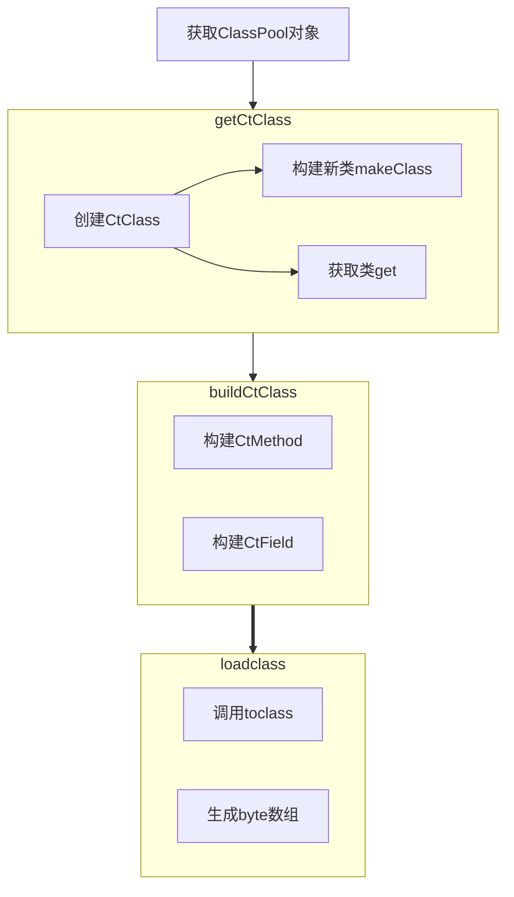

#字节码增强 #javassist

## DOC地址

http://www.javassist.org/tutorial/tutorial2.html

## 使用流程

## 主要方法

### ClassPool 主要方法

全路径: javassist.ClassPool

> 需要注意的是 ClassPool 会在内存中维护所有被它创建过的 CtClass，当 CtClass 数量过多时，会占用大量的内存，API中给出的解决方案是 **有意识的调用`CtClass`的`detach()`方法以释放内存**。

1. `getDefault` 返回默认单例的ClassPool,一般都是通过这个方法构建
2. `appendClassPath`,`insertClassPath` 将一个 `ClassPath` 加到类搜索路径的末尾位置 或 插入到起始位置。通常通过该方法写入额外的类搜索路径，以解决多个类加载器环境中找不到类的尴尬
3. `toClass` : 将修改后的 CtClass 加载至当前线程的上下文类加载器中，CtClass 的 `toClass` 方法是通过调用本方法实现。**需要注意的是一旦调用该方法，则无法继续修改已经被加载的 class**
4. `get`、`getCtClass` : 根据类路径名获取该类的 CtClass 对象，用于后续的编辑。
5. `makeClass` : 创建一个新CtClass类, 如果已经存在于ClassPool 则会覆盖

### CtClass主要方法

> CtClass 使用builder模式, 构建完之后即可以往里面添加 interface(类型转成CtClass),`CtMethd`,`CtField` 字段,`CtConstructor` 构造方法等组件,或者是从`CtClass`中获取已有的成员

1.  `detach` : 将该class从ClassPool中删除；
2.  `writeFile` : 根据CtClass生成 `.class` 文件；
3.  `toClass `: 通过类加载器加载该CtClass。

### CtMethod 主要方法

>  `insertBefore()` 和 `setBody()`中的语句，如果你是单行语句可以直接用双引号，但是有多行语句的情况下，你需要将多行语句用`{}`括起来。javassist只接受单个语句或用大括号括起来的语句块。

1. `insertBefore` : 在方法的起始位置插入代码；
2. `insterAfter` : 在方法的所有 return 语句前插入代码以确保语句能够被执行，除非遇到exception；
3. `insertAt `: 在指定的位置插入代码；
4. `setBody` : 将方法的内容设置为要写入的代码，当方法被 abstract修饰时，该修饰符被移除；
5.  `make` : 创建一个新的方法。

## javassist使用遇到的问题

### 1. 使用限制![[javassist使用限制#使用限制]]
### 2.  泛型问题![[ javassist 范型问题]]