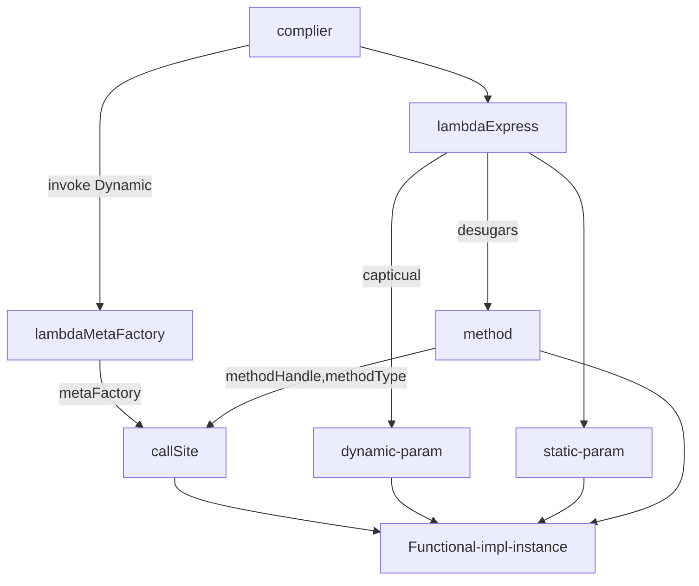

---
dg-publish:
  - "true"
tags:
  - javabasic
  - lambda
  - 字节码增强
createTime: 2023-01-27 12:49
---
> 本文为研读[lambda设计参考](https://cr.openjdk.java.net/~briangoetz/lambda/lambda-translation.html) 的翻译和小结

本文档概述了将 lambda 表达式和方法引用从 Java 源代码转换为字节码的策略。Java 的 Lambda 表达式由[JSR 335](http://jcp.org/en/jsr/detail?id=335)指定并在 OpenJDK [Lambda 项目](http://openjdk.java.net/projects/lambda/)中实现。可以在[State of the Lambda](http://cr.openjdk.java.net/~briangoetz/lambda/lambda-state-4.html)中找到语言功能的概述。

## 概念介绍

函数式接口是 Java 中 lambda 表达式的核心方面。函数式接口是一种具有一个非`Object`方法的接口，例如`Runnable`,`Comparator`等（Java 库多年来一直使用此类接口来表示回调。）

Lambda 表达式只能出现在它们将被分配给类型为函数式接口的变量的地方。例如：

```
Runnable r = () -> { System.out.println("hello"); };
```

或者

```
Collections.sort(strings, (String a, String b) -> -(a.compareTo(b)));
```

编译器生成的捕获这些 lambda 表达式的代码取决于 lambda 表达式本身，以及分配给它的功能接口类型。

## 依赖和引用关系

`lambdaExpression`转换过程依赖于[JSR 292](http://jcp.org/en/jsr/detail?id=292)的几个特性，包括 invokedynamic、方法句柄以及`LDC`方法句柄和方法类型的增强字节码形式。
-   `method handle constants`：`(class-name.method-name)`
-   `method type constants` : `(method-signature)`
-   `invokedynamic`：`((bootstrap, static args...)(dynamic args...))`

## 转换过程

可以通过多种方式在字节码中表示 lambda 表达式，例如内部类、方法句柄、动态代理等。这些方法中的每一种都有利有弊。在选择策略时，有两个相互竞争的目标：
1. 通过不承诺特定策略来最大化未来优化的灵活性，
2. 在类文件表示中提供稳定性。
[我们可以通过使用JSR 292](http://jcp.org/en/jsr/detail?id=292)`invokedynamic`中的特性来实现这两个目标。将字节码中 lambda 创建的二进制code与运行时计算 lambda 表达式的机制分开。我们没有生成字节码来创建实现 lambda 表达式的对象（例如调用内部类的构造函数），而是描述了构造 lambda 的方法，**并将实际构造委托给语言运行时**。该方法被编码在`invokedynamic`指令的静态和动态参数列表中。

## 执行流程

### invokeDynamic

当编译器遇到 lambda 表达式时，它首先将 lambda 主体脱糖(`desugar`)为一个方法，该方法的参数列表和返回类型与 lambda 表达式匹配，可能还有一些额外的参数（对于从词法范围捕获的值，如果有的话）。在捕获 lambda 表达式的位置，它会生成一个`invokedynamic callSite`，调用时，会返回 lambda表达式转换为的 实现了Functional interface的实例。此callSite 就是给出lambda实例 的 _lambdaFactory_。 _lambdaFactory_ 的动态参数是从词法范围捕获的值。启动 _lambdaFactory_ 的方法是jdk的一个标准类 _lambdaMetaFactory_ 提供的. 它在编译时获取当前 lambda 的已知信息并作为入参(即获取当前lambda的[[#依赖和引用关系]])

### method reference

`method reference`的处理方式与 lambda 表达式相同，除了大多数`method reference`不需要脱糖为新方法；我们可以简单地为引用的方法加载一个常量方法句柄并将其传递给 _lambdaMetaFactory_。

### 图例


## 主要步骤详解

### Lambda desugar

将 lambda 转换为字节码的第一步是将 lambda 主体脱糖为方法。

围绕脱糖必须做出几个选择：

-   我们是对静态方法还是实例方法进行脱糖？
-   desugared 方法应该放在哪个类中？
-   脱糖方法的可访问性应该是什么？
-   脱糖方法的名称应该是什么？
-   如果需要调整以弥合 lambda 主体签名和功能接口方法签名之间的差异（例如装箱、拆箱、原始扩大或缩小转换、varargs 转换等），如果脱糖方法遵循 lambda 主体的签名，则功能接口方法，还是介于两者之间？谁负责所需的调整？
-   如果 lambda 从闭包作用域捕获参数，那么这些参数应该如何在脱糖方法签名中表示？（它们可以是添加到参数列表开头或结尾的单个参数，或者编译器可以将它们收集到一个“框架”参数中。）

与 lambda 主体脱糖问题相关的是方法引用是否需要生成适配器或“桥接”方法。
编译器将为 lambda 表达式推断出一个方法签名，包括参数类型、返回类型和抛出的异常；我们将其称为 _natural signature_。Lambda 表达式也有一个目标类型，它将是一个函数式接口；我们将 _lambda descriptor_ 符称为目标方法擦除的方法签名。从实现了functional接口并捕获 lambda 行为的 lambda 工厂返回的值称为 _lambda object_。

🌟🌟🌟 同等条件下，私有方法优于非私有方法，静态方法优于实例方法，最好将lambda主体脱糖到出现lambda表达式的最内层类中，签名应与lambda的主体签名匹配，`extra arguments` 应该放在捕获值的参数列表的前面，并且根本不会被 desugar 方法引用。但是，在某些例外情况下，我们可能不得不偏离此基准策略。

#### Desugaring Example

#####  无状态[stateless] lambda
```java
class A {
    public void foo() {
        List<String> list = ...
        list.forEach( s -> { System.out.println(s); } );
    }
}
```

The _natural signature_ of the lambda is `(String)V`; the `forEach` method takes a `Block<String>` whose lambda descriptor is `(Object)V`. The compiler desugars the lambda body into a _static method_ whose signature is the _natural signature_, and generates a name (_lambda_)for the desugared body.

转成字节码后:
```java
class A {
    public void foo() {
        List<String> list = ...
        list.forEach( [lambda for lambda$1 as Block] );
    }

    static void lambda$1(String s) {
        System.out.println(s);
    }
}
```

##### 获取不可变参数[ capturing immutable values] lambda

```java
class B {
    public void foo() {
        List<Person> list = ...
        final int bottom = ..., top = ...;
        list.removeIf( p -> (p.size >= bottom && p.size <= top) );
    }
}
```

捕获的值 (`bottom`和`top`) 可以装入框架或数组中,编译器对于如何表示这些额外参数有一定的自由度:它们可以单独添加到前面,装入框架类,装入数组等。最简单的方法是单独添加它们

转成字节码后:
```java
class B {
    public void foo() {
        List<Person> list = ...
        final int bottom = ..., top = ...;
        list.removeIf( [ lambda for lambda$1 as Predicate capturing (bottom, top) ]);
    }

    static boolean lambda$1(int bottom, int top, Person p) {
        return (p.size >= bottom && p.size <= top;
    }
}
```

关键是在`desugar lambda` 方法的签名中出现的`extra arguments type`与它们作为 lambda 工厂的（动态）参数出现的类型之间的一致。由于编译器控制着这两者，并且它们是同时生成的，因此编译器在如何打包捕获的参数方面具有一定的灵活性。

### lambdaMetaFactory

`Lambda capture` 将由 `invokedynamic`  字节码操作后生成的 `callSite` 来生成的，其`static parameters`描述了 `lambda body`和 `lambda descriptor`的特征，其`dynamic parameters`（如果有）是捕获的值。调用时，此`callSite`为相应的 `lambda body and lambda descriptor`返回一个 lambda 对象绑定到捕获的值。生成`callSite`对应方法称为 _lambdaMetaFactory_. （我们可以为所有 lambda 形式使用单例`LambdaMetaFactory`，或者为常见情况使用专门的版本。）VM 将只为每个`callSite`调用一次`lambdaMetaFactory`；此后,关联上`callSite` 的不再调用。`callSite`是惰性链接的，因此从未invoke 过的`callSite` 不会关联上`lambdaMetaFactory`。metaFactory的静态参数列表如下所示：

```
metaFactory(MethodHandles.Lookup caller, // provided by VM
            String invokedName,          // provided by VM
            MethodType invokedType,      // provided by VM
            MethodHandle descriptor,     // lambda descriptor
            MethodHandle impl)           // lambda body
```

前三个参数 ( `caller`, `invokedName`, `invokedType`) 由 VM 在调用点链接处自动堆叠。

该`descriptor`参数标识 lambda 转换为的`functional interface method`。（通过方法句柄的反射API，metafactory可以获得functional interface class 的名称及其主要方法的名称和方法签名。）

该`impl`参数标识 lambda 方法，可以是脱糖的 lambda 主体，也可以是方法引用中命名的方法。

功能接口方法和实现方法的方法签名之间可能存在一些差异。实现方法可能有额外的参数对应于捕获的参数。其余参数也可能不完全匹配；某些改编（子类型、装箱）是允许的。

### Lambda capture

我们可以将class A 编译成下面的字节码 
```java
// indy -> invokeDynamic
class A {
    public void foo() {
            List<String> list = ...
            list.forEach(indy((MH(metaFactory), MH(invokeVirtual Block.apply),
                               MH(invokeStatic A.lambda$1)( )));
        }

    private static void lambda$1(String s) {
        System.out.println(s);
    }
}
```
Class A 这里动态参数是空的 ,所以直接传入的是一个`()` 我们看下Class B
```java
class B {
    public void foo() {
        List<Person> list = ...
        final int bottom = ..., top = ...;
        list.removeIf(indy((MH(metaFactory), MH(invokeVirtual Predicate.apply),
                            MH(invokeStatic B.lambda$1))( bottom, top ))));
    }

    private static boolean lambda$1(int bottom, int top, Person p) {
        return (p.size >= bottom && p.size <= top;
    }
}
```
可以看到动态参数列表传入了` (bottom,top)` ,下面静态方法生成的时候是加入了这2个动态参数

### 静态方法与实例方法

像上一节中的那些 Lambda 可以转换为静态方法，因为它们不以任何方式使用封闭对象实例（不引用`this`、`super`或封闭实例的成员。）总的来说，我们将引用 `this`、`super` 、实例成员变量参数的lambda 作为 _instance-capturing lambda_ 。

**_non_instance-capturing lambda_ 被转换为私有的静态方法。_instance-capturing lambda_ 被转换为私有实例方法**。 这简化了实例捕获 lambda 的脱糖，因为 lambda 主体中的名称与脱糖方法中的名称含义相同，并且与可用的实现技术（绑定方法句柄）很好地结合在一起。当捕获实例捕获 lambda 时，接收者( `this`) 被指定为第一个动态参数。

例如，考虑一个捕获字段的 lambda `minSize`：

```
list.filter(e -> e.getSize() < minSize )
```

我们将其脱糖为实例方法，并将`this`作为第一个捕获的参数传递：

```
list.forEach(INDY((MH(metaFactory), MH(invokeVirtual Predicate.apply),
                   MH(invokeVirtual B.lambda$1))( this ))));

private boolean lambda$1(Element e) {
    return e.getSize() < minSize;
}
```

因为 lambda 主体被转换为私有方法，当将行为方法句柄传递给`lambdaMetaFactory`时，捕获站点应该加载一个常量方法句柄，其引用类型是 `REF_invokeSpecial`实例方法和`REF_invokeStatic`静态方法。

我们可以对私有方法进行脱糖，因为捕获类可以访问私有方法，因此可以获得私有方法的方法句柄，然后元工厂可以调用该方法。（如果元工厂正在生成字节码来实现目标功能接口，而不是直接调用方法句柄，它将加载这些 `Unsafe.defineClass`不受可访问性检查影响的类。）

### Method reference capture

分为实例捕获和非实例捕获

##### 非实例捕获方法引用:
1. 静态方法引用（`Integer::parseInt`，使用引用类型 invokeStatic 捕获）
2. 未绑定实例方法引用（`String::length`，使用引用类型 invokeVirtual 捕获）
3. 顶级构造函数引用（`Foo::new`，使用引用类型 invoke_newSpecial 捕获）

捕获非实例捕获方法引用时，捕获的参数列表始终为空：

```
list.filter(String::isEmpty)
```

被翻译成

```
list.filter(indy(MH(metaFactory), MH(invokeVirtual Predicate.apply),
                 MH(invokeVirtual String.isEmpty))()))
```

##### 实例捕获方法引用
1. 绑定实例方法引用（`s::length`，用引用种类 invokeVirtual 捕获）
2. 超方法引用（`super::foo`，用引用种类 invokeSpecial 捕获）
3. 内部类构造函数引用（`Inner::new`，用引用种类 invokeNewSpecial 捕获）。

捕获实例捕获方法引用时，捕获的参数列表始终只有一个参数，`this`在超类或内部类构造函数方法引用的情况下，以及绑定实例方法引用的指定接收者。

### Varargs

如果对可变参数方法的方法引用被转换为不是可变参数方法的功能接口，则编译器必须生成桥接方法并捕获方法句柄，而不是目标方法本身。桥接方法必须处理任何需要的参数类型调整以及从可变参数到非可变参数的转换。例如：

```java
interface IIS {
    void foo(Integer a1, Integer a2, String a3);
}

class Foo {
    static void m(Number a1, Object... rest) { ... }
}

class Bar {
    void bar() {
        IIS x = Foo::m;
    }
}
```

在这里，编译器需要生成一个桥来执行从`Number`到的第一个参数类型的适配`Integer`，并将剩余的参数收集到一个`Object`数组中：

```java
class Bar {
    void bar() {
        IIS x = indy((MH(metafactory), MH(invokeVirtual IIS.foo),
                      MH(invokeStatic m$bridge))( ))
    }

    static private void m$bridge(Integer a1, Integer a2, String a3) {
        Foo.m(a1, a2, a3);
    }
}
```

### Adaptations(参数适配)

脱糖的 lambda 方法有一个参数列表和一个返回类型：（`(A1..An) -> Ra`如果脱糖的方法是一个实例方法，则接收者被认为是第一个参数）。`funcitonal interface method`同样有一个参数列表和返回类型：（`(F1..Fm) -> Rf` 没有接收者参数）。并且工厂站点的动态参数列表具有参数类型`(D1..Dk)`。如果 lambda 是实例捕获的，则第一个动态参数必须是接收者。

这些的长度必须加起来如下：`k+m == n`. 也就是说，lambda 主体参数列表应该与动态参数列表和功能接口方法参数列表的总和一样长。

我们将 lambda 主体参数列表`A1..An`拆分为`(D1..Dk H1..Hm)`，其中`D` 参数对应于`dynamic params`，`H`参数对应于`functional interface`参数。

`Hi`我们要求_适应_ `Fi`for `i`in `1..m`。同样，我们要求`Ra`适应`Rf`. 在以下情况下， T型_适用于_U 型：

-   T == U
-   T是原始类型，U是引用类型，T可以通过装箱转换为U
-   T 是引用类型，U 是原始类型，可以通过拆箱转换将 T 转换为 U
-   T 和 U 是原语，T 可以通过原语扩大转换转换为 U
-   T 和 U 是引用类型，T 可以转换为 U

适配由元工厂在链接时验证，并由元工厂在捕获时执行。


## 小结

每次阅读都对lambda表达式 和java字节码的了解更加深入,这里研究设计参考是为了对lambda使用ASM插桩做准备