## 概念

-   什么是Mermaid？
	- Mermaid是一种基于Javascript的绘图工具，使用类似于Markdown的语法，使用户可以方便快捷地通过代码创建图表。
	- 项目地址：[https://github.com/mermaid-js/mermaid](https://link.zhihu.com/?target=https%3A//github.com/mermaid-js/mermaid)（需要将梯子设置成全局模式才能访问）

## 破坏语法的特殊字符

❕ 将文本放在引号内一遍渲染复杂字符
> graph LR;
> id1["(TEXT)"]
> 此处不加引号会出错
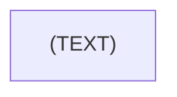
## 饼状图

**表类型关键字**: `pie`
**表名**:  `title`
例子:
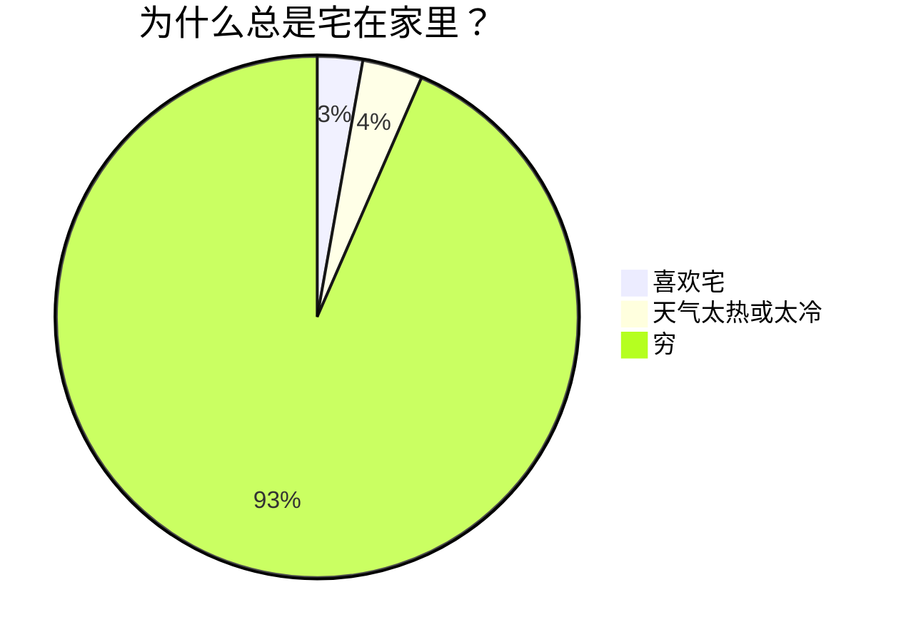
## 流程图

**表类型关键字**: `graph`

**方向**：用于开头，声明流程图的方向。
-   `graph`或`graph TB`或`graph TD`：从上往下
-   `graph BT`：从下往上
-   `graph LR`：从左往右
-   `graph RL`：从右往左
例子:
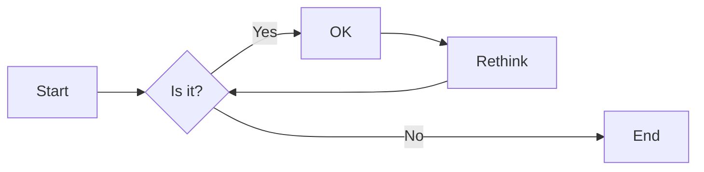

### 结点形状

**由节点边框控制形状**

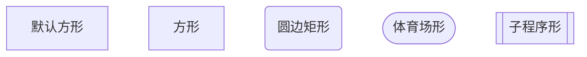

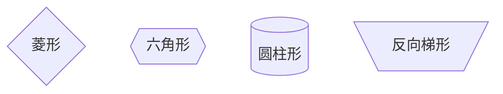

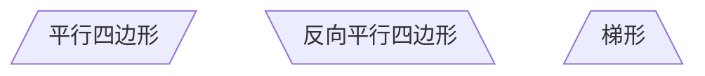

### 连线形状

**由书写格式控制**

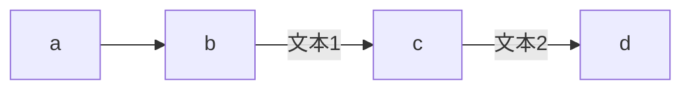
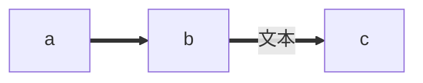
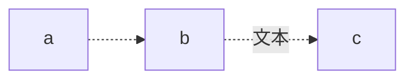
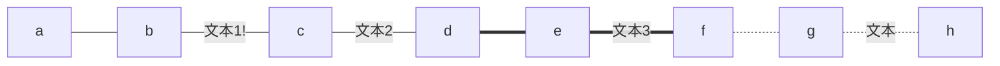
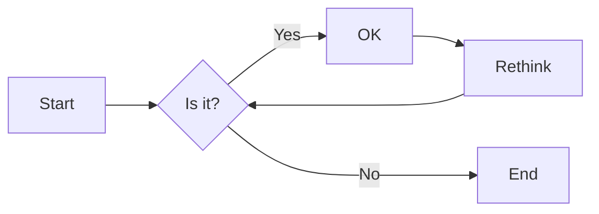
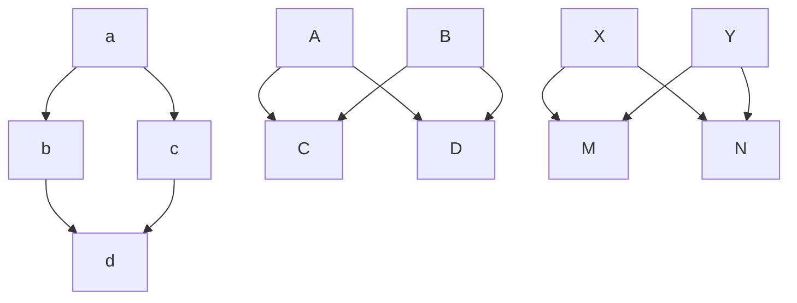

## 子代码块流程图

**图形关键字**: `flowchart `

**块状开始定义**: `subgraph `

**块状结束定义**: `end`

例子:
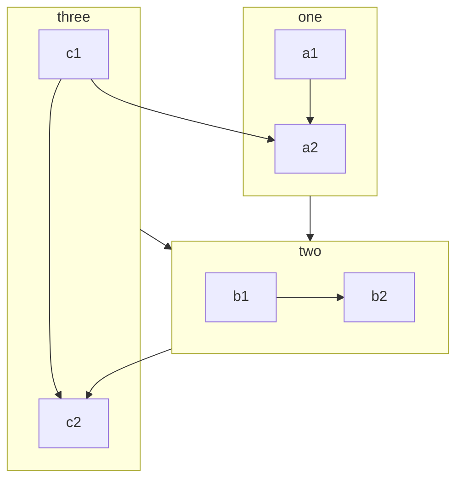

## 注释

在行首加入`%%`即可。