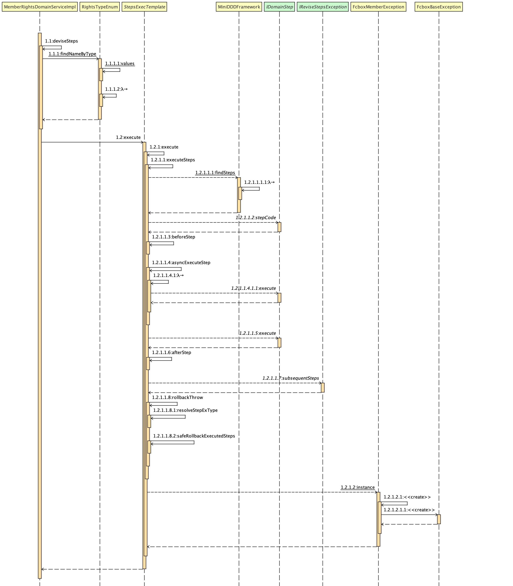

## 领域驱动设计

> Domain Driven Design (DDD) is about mapping business domain concepts into software artifacts.

### 为啥用DDD

DDD是真正解决业务问题的架构思想：

* 把业务设计和业务开发统一，产品同学和研发同学统一
  * 统一在domain层，DDD的精华在这一层
  * 业务专家角色，在互联网领域大部分是缺失的，实际上是谁更懂谁就专家
* 业务和技术解耦

    * 本质上，DDD是把技术从业务中剥离：让业务成为中心，技术成为附属品

      * 技术是为业务服务的

      * 业务是业务，技术是技术，不要搅在一起
      * domain层，是业务核心：不要把业务模型和规则逃逸、泄露到其他层
        以领域为核心的分层架构，技术手段通过倒置依赖进行隔离
      
    * 是面向业务的设计和编程，不是面向数据库的编程，也不是面向技术实现的编程
      
    * 客观上起到了控制软件复杂度的作用,避免业务逻辑的复杂度与技术实现的复杂度混淆在一起，因为他们的变化维度和关注点不同
      
    * 把业务逻辑集中到domain一层，使得产品和研发能有一个共同的代码交流场所
      
        * UL落地到这一层
        
        * 前提是代码的业务表达力
    
* 统一并一致的领域建模和代码实现
  * 分析模型和设计模型不再割裂
  * 降低了出现不一致的可能性
* 改变过去Service + 数据库技术驱动开发模式
  * 回归业务本质，代码有更强的业务表达能力
  * 沉淀出反映领域知识并聚焦于关键概念的模型
  * 激发研发同学热情，解放研发生产力，不再束手束脚，可以充分发挥面向对象的优势写业务代码
    * 面向对象思想在解决业务问题上是非常理想的不二选择
    

### 部分名称定义

  领域整体结构图可以用下面一张图来表示

* 名称
    写下名称,并获得团队一致性认可,这个名字将确定如何对该领域进行设计

* 领域
  * 核心功能: 具有重要意义的功能实现
  * 支持功能: 必要但是不是很明显区分的功能
  * 通用功能: 一般领域都有的功能

* 业务模型
  * 直接来源: 用户直接输入的模型源
  * 业务模型的参与源: 用户也需要,但是不会直接输入
  * 调用接口, 不直接暴露内部的数据信息,保持数据一致性
  
* 模型构建过程依赖的service

  * 未开发service
  
  * 已存在,但是有差异的service
  
  * 通用化的service
  
* 水平任务编排
  
   如图
  
  
  
  * 接口的步骤编排,可以组织成对应泳道图,显示步骤的流转和编排

  ### 设计的优化
  
  领域服务暴露出去的公有接口是比较基础的,随意改动对调用方有很大的影响,所以好的设计是必不可少的,相关优化点可以提供参考
  
  * 接口名称与实际上的功能是不是一致的,能否望文生义
  * 接口实现功能最小单元,最好就是一次操作或者一个事件
  * 接口太重,或者说实体过于独立不能抽象
  * 暴露最少内容
  * 边界问题
  
  ### 落地框架
  
  > https://github.com/funkygao/cp-ddd-framework
  
  ![img](https://camo.githubusercontent.com/81bd20f160c6cb3f2208a111e714665706a9c8cb069eb6f803d278d31f03fae8/687474703a2f2f7777772e706c616e74756d6c2e636f6d2f706c616e74756d6c2f7376672f584c4844526e436e344274784c756e7751572d666e334c514c497134663176304c5369544a556e397265684e5a6b705066415a716c70444537445746387441417678727679787474594a356f7470634c546a526c434d3837424e66705a3951504636704739486657674b4b4a5a6a506c632d50656b56726e566a5f543053555562414344306d5538546a696f36316a39696d7255674a7467374d753964626f5f6a48775176656b386152597a415032567a4b6e6e57766857795436475079695f646f6135547730756e4c5558472d695f6c7042763944394a453056306a5145665f4d696d7631774f4b5253545548525f634a3166512d59355150796b6737514f345a6d58327963464239347a48564d6b62307a4353444b365861576b6543636e686d304a56466b57496836746a5f6358505a4d794b336e4f4a484c30536232335f78303455594e54437274563344644654305978373733654c5a3641566d7045684d4b36386c3264485433794d596e63335074586975354b5564644153457a34486d424b794b5a554b31474f7275615a51655249516a42566748445666685f4748716d625f7555725448395370496d596b494d2d6632726e677649445a55635f393443527844733844696a6a4438464c51594e6c6a794a384c687a4234362d414d58717967476171735234536b585741466b737243336661744c774e415071775577464b55384641654568424b79336768696e4c4166724e716d7166596b44517767706774537442463746426456714a4261544e364d345a6942487a4e37516e4c484168625261343570476f4c5659426e5471626a6f4d6950506e724969636c4b44496475356175353235426579624e62537a5a593649746978734762326567796a52316132666e6f7443556b4457682d766772315f724f476559776653484847374c46746b486c5f637930)
  
  在github发现一个比较能实现的落地DDD框架,将每个抽象的概念用代码具象化,通过代码弱约束,和校验框架的强约束(ArchUnit),来实现对应框架规范,比如我在项目中,需要实现权益发放,需要编排多个步骤,这里单个步骤整体的结构图形如下
  
   
  
  整体权益发放流程图如下
  
  
  
   	在权益发放过程中, 调用权益领域时,将流转的过程隐藏,将业务具体流程和调用流程解耦,使开发者将重点放到各个具体的业务步骤中,然后通过before 和after step方法对步骤进行增强,还有实现了本地的异常补足, 抛出指定异常后,可以执行在异常中指定的stepCode,使代码充满弹性.
  
  ### 参考
  
  1. https://virtualddd.com/learning-ddd
  2. https://github.com/ddd-crew/ddd-starter-modelling-process
  3. https://github.com/dddplus/dddplus

