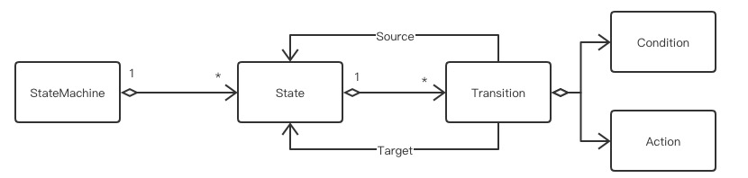

## 状态机介绍

我们在开发过程中,发现一些场景优化可以很明显的使用状态机模式对模型进行状态的转移, 状态模式也是我们在开发的过程中常用的模式, 毕竟写起来很简单 ,有用一个枚举就可以表达. 该文章给大家介绍下状态机相关的知识点

### 状态模式

状态模式，又称状态对象模式（Pattern of Objects for States），状态模式是对象的行为模式。状态模式允许一个对象在其内部状态改变的时候改变其行为。这个对象看上去就像是改变了它的类一样。

状态模式所涉及到的角色有：
-  环境(Context)角色，也成上下文：定义客户端所感兴趣的接口，并且保留一个具体状态类的实例。这个具体状态类的实例给出此环境对象的现有状态。
-  抽象状态(State)角色：定义一个接口，用以封装环境（Context）对象的一个特定的状态所对应的
-  具体状态(ConcreteState)角色：每一个具体状态类都实现了环境（Context）的一个状态所对应的行为。

![img](data:image/png;base64,iVBORw0KGgoAAAANSUhEUgAAAkkAAADbCAIAAAD205ICAAAfcElEQVR4nO2dLazkyNWGO+RqwYBBUZQfaQMsXRBFoyRggcEGrDRSEmCUgStZkZZFigw2aJG1MMTRgigKKLDYIBpoELDEUhQ0KjRBvnCAwYX+wPnu0UnZ7evudtunT70P6nZX26dO/bz156rDAAAAANjisLcBAAAAwMpA2wAAAFgD2gYAAMAa0DYAAADWgLYBAACwBrQNAACANaBtAAAArAFtAwAAYA1oGwAAAGtA2wAAAFjjNG179erVAWjl1atXV8olAABwW5ymbYcD+nl6QeoAAAABbbMDUgcAAAhomx2QOgAAQEDb7IDUAQAAAtpmB6QOAAAQ0DY7IHUAAIC4YW3z3nvv97ZCEapSBwAAduRWtS3LsqIoyrJMkqSqqr3NUYGe1AEAgH25SW3Lsoz1rGmaPM/PuElRFJfY0DRN27aX3GF1lKQOAADszu1pm/c+SRJ5pa7rmfB9309eTNP0EjPyPIe2AQCATm5P28qyPCZLRVGkaZplWVmWwzB479M0zfM8yzK6TsHoyuFwyLIsyzKetKvrOnuCrjjn0jRNksQ5lyRJmqbee+dclmX0Ncsy59z1I70IDakDAAAasKNtNP1Gn/M8J8mhwNR1S9NU9rSCzl/XdXzbqqpY3qibSP082QUM7qYBDakDAAAasKNtSZKw2DRNQ2HKsmTBS9OUPw8jbSvLkoYZ27alXhr/VBRFkiTByCe0DWwG9ijfGGw7boDb07aqqgJZIo2RF9u2pa8naRsNZjL8U13XSZI0TSPDQ9vAZiBlNwYON8DtaVvXdUmSdF3HX2mdpOy30ZTYsEzbqEMmxyGH/12fQpNqQWeRtS3QvB3RkDrgGiBlNwYON8DtadvwtGak67qu67IsI50j+en7nmbOaIVIURS81j/QtjRNnXNN0/BFflWuqqrx1F2apvK1gTzPi6JgZdWAktQBq4OU3Rg43AA3qW3DMDjnWF34Ir3rVhQFCVvf99Rv6/ueNIw+U2DvfZ7n8r3vrutoZJKXPjrnyrJ0zvGtZC+NhFMasC96UgesC1J2Y+BwA9yqtoExSB2rXJKydV2PX/GkNVP8ldpwZz/iVHvqul7rzZnJ+1x+cxQlA0Db7IDUscrZKVvX9XjFU9u2waJf59zCbXou3MG1LEuyZ8WtDya33LtwHz4UJQNA2+yA1LHKeSm7UNhO4sKd6uRyrRVZXd5QlAwAbbMDUscqZ6TscmFr25YmlflK0zR1XXvv5QQzzUbTKq2g90aT2Xyx67qqquhBPPzY9z3tE9S2rfw7BZZ/l/cMFiEHJknWlTcUJQNA2+yA1LHKqSnrnBsLm/f+WI8teKGzbdssy0hC8jyXq6XGHa+iKOhZrGd0h6Ioqqrq+5629Zn8u1xmzEvA5D2LouB7OudIJunm41isKG8oSgaAttkBqWOVM7RtvJ7Ce39sRHGsbfyVZ8iIQJyCe/I7oG3bTm4eNJZG7oSxntECZv6VA8j/ju8zKXjHVPBZUJQMAG2zA1LHKmek7KS8Havrz9a2tm3zPK+f4F/lHSRjTaJHk2H0oMAYJk1T+SA5hrmusA0oSiaAttkBqWOV81J2ubxdom2TOrRQ26qq4jFDflDwQsKx8cz5GF0ibAOKkglOS8K7u7v19yUFK3F3d3elXAL25XBuVbtQ3s7QNh4qlGOP/KyF2pbnOd+HHkS9MXlPFr8sy+SmesficuziSZztcKAH9NvsgNSxyiUp65wbb50jF0zWdU077PAVOhOj7/u+7+XRUcNTp0ou0OD9ffhi0zRVVdFYJfe6+r6nsUTa6I4udl1HS05Ig/M8J22joc7gQcPTOVbOOR6QnFTQy99DR1EyALTNDkgdqyBlNwYONwC0zQ5IHasgZTcGDjdAvNrmvdezzfEqWEodIEHKbgwcboAYtY12WGjbtmkaOUF969hIHTAGKbsxcLgBNtK25VusXrLZ3ULkYq2maYIN0RfeZK2NzFcEBdIqSNmNgcMNsIW2VVW1sG90bOnwcpaIaJZl41M/hmHo+37hXq7LQ24JCqRVkLIbA4cbYE1t897TtqdlWdL7Jbzwl/aaY+GhlcQEX6S1yLR0WG6HyiGXdJWSJHk2WF3XaZoGO67S3qy89wFfp2XHHKOZkCTMMuTGoEBaBSm7MXC4Ac7RNn4hhqEqXna5ZP0evP45iFHBoKM27rfJbb+DbVsnWTj4SZu0jhVuvG8CWx78NO638RW5A+yWoEDeCp9//vk//vGP5eGVpGxRFFmWZVkWHFhvDyUOB5ewZr+trmu50QAz1rZhGJqmobc157VNSsj4Xc4LoUM3pMFjxeq6zjlXVVWSJMcMG0aWB4G3AQXyVnj//v3nn3/+8ccfL1Q4DSkr9y6h4Rn+afnc8/h8HJ1ocDi4kJXn2/iQJ5ndJ/ttpCjP9ttoHSMVibZtJ+fJTiU4Pmpmf3F5HvF8v422+fFP7LL2ciZ1mqZ5/fr127dvt7QHzLNc4TRUtUErUBbwyS3/J+ENkZWjweHgQlbut/HnoL/Fp1cM/7sX6oy2kYxlWSbHIZ/VtiXiJ8dLg/FDNnu8r90xbaOQ8mAOisizZqzOZOo8PDy8efPm008/ffv27evXr1+/fv3+/fvNTQNHWaJwGqrayTF8ung4HGiskluN9HZNlmVc1pxzWZYdDoc0TWnnLb4J/cQbbmlAg8PBhaypbfyuWN/3sqKnxRfDk/jJrlJVVUVRyIxOP7FMeu9Z3p4dkKSDEJ99i0BukVcURXD0Yt/3bdvSRR5ipdMa5XKYICQFJgvp2OJ5G67BOHW+/vrr+/v7b7/9lq+8ffv2/v7+q6++enx83NY6MMe8wimpaouiSJIkOF9mGI3Ae+/5Cq0O45/o3G0ZmPauHIahbdskSZRsp6DE4eASVl4n6b1fcuYvTWLJzlzwU/B3eUThPEtEhfp2x+5Z17UsYCRUdCUwNQhJASa3pt0GmTpN09zf33/55ZcfPnwIgj0+Pn711Vf39/cYotTGMYXTU9XSOEewGnk8u1xVVdd11HuTgx9jbZN6lqapkiUqehwOzibGfUmsQqnDg5Dv3r2bCfz+/XsMUepkrHAayp0c7Q+WVo21Lc9zGvMoiuJZbcuegLaBFYG22eFwOIwHIefBEKVapMJpKHfBfPOktvHcAQemlWUckrWNlVLPOKREg8PBhUDb7PDRRx/9+te/Hg9CzvP4+Pib3/zmxYsXF52LCq7MlfLMcvI8DxaG8E9JktAaZgpAnTb6ifptPL1N2zhQGL6t/KxE5zQ4HFwItM0Oh8Ph1GHGhQOYYBfevXtHCaqh3NGGO3me05pG+ZNzLk1TqUz8ijf9xJNz9EYpvwJE0D1prdZWsXkGDQ4HFwJtswOlzvJhxlMHMMFmPDw8fPHFF7zeB+VuY+BwA0Db7MCp8+xKyJlVlGBfHh8fqc3xzTff8EWUu42Bww0AbbNDkDqTKyExCKmZb7/9drLNgXK3MXC4AU5Lwru7u80n0cFS7u7uxkkmhygxCKmW77777pNPPnnz5s3kXOkBVe22wOEGQL/NDsdSh4YoP/roIwxCKuT9+/dv3rz55JNPvvvuu2NhUO42Bg43ALTNDkid2+LDhw9ffvnlkp40UnZj4HADQNv+f1/jm9iefB6TqWOVb7755v7+/uuvv17y1jzmAjZmcngf3Baxaxtva0nnye1tzhzPHnFgL3Ws8umnn37xxRcPDw8LwyNlNwYON4AibfPe05mHvDX4tfHeB2eF77stQl3Xx47Cqut6fG5qAAqkVZCyGwOHG+AibQvOET2VQEhk3R1o28JDAE4KOUydsr2Nps4ws1cstC1abjFlaZMR5WMhx7hFh4OAi7RNHvJ5KnVdjw/j5s9y/K3v+4UiujzkMDqVdGyDNqBt0bIwZVc82zM4m/6k3bC6ruMmmnNu9xNHZwZjjtmGomSAlbXNOUcnf8rCQAeQcnbv+552mauqKjjtc6xMNBaX53ld17JPRvcsy5L/fiwkDTwWRRGUT+fcuFHJR4Q/izxT+Bh0KCtZSPN5pNld141NogNBxgLGIaFt0bIkZYuiOGnQYv5WcgfIsiyXHz3TdV1QLi5pAV8OnVc8qWG0ueXkv1CUDHCOtlGVTadX0AcqVGVZcn9LbgTOp1rI2nlSRfie8mLbtsGVPM/5QfKe45Cyc8Z2zhuwsBgHCnoMLjxN03ABY5P4RHK2PyhseZ5Pem8SFEirTKZskFFXHHIIbnXS9vwKx0KOdc6oNTn5E4qSAdbst1VVJTtn9EHm7DRNuZDM9JCC8wwnFYuuV1U1H1I+pW1bWfCOadtajV+iqipqArNhfIUI7A+0TX6FtkXLZMoGB9kvnyqeX3DbdV2Q05aLU1EUYyFZ/veNRy/zPMeYpGHWH5Ok4yo406RpWj8hO3bzo39lWbIAjBXLOcdtyfl+G/XD2ADZ1B0HHo4UzgshCzk6QcQD+2ekDtoWLeOUDQbYaXyeBuq5VNIweDD6TYuQaUFyMI7CS5Rl28s5F3QQ67rm28rrk/q6XHTLshyf3x3gvc+yjMzz3rM40cApGc+tZ++9cy64p/eefBUcmhqAomSANbWNVUE2/Y5loLG2yRLVNA2XqLEIHavxJ7VN9sOCFutYLa4xfkLziFzkTuq3SXugbdHCKVvXNakXTfeyaPF51sNTPpGD2LJcSOniAHmeczEZd9rkgCRPMYxDTrYLq6paOBDSdd2SkU9+KM9et23LFZH8PDzpn/zKf6em9rGnoCgZYM3322Q24jwk56VlA5CXcnCLUpYieStu+nGhYgEgEeXr45AUgMtAoKaB8p30+vbkypdJaOGMvCLn24Ku5FjbyGa6yfxoEgqkVeb7bdQXoc9yhRStb6ScI1ds8a+UD5um4Qw57mZJAZMhh1GzdbIVu3pjkW7ovWcPBK1DaWEgt0ENMyOlKEoGWFPbnHPUGqrrWuYbGsEYLyOmgREOycOGwd+Hp0YWKxMtwaAtRehfx0IOTyuSq6qaHAINSsJ89CUnzcwFcaeVohRTvtg0DXtPahgbzw3VY6BAWiVI2fGA5Fi65MpkuaCJL3KPSk47Bd2sYC0x9fm8QJoxlrHJpcgXQk/hZmWwHkS2pAOTgnnEedFFUTKAon1J9oIKw/JVzmoxmTpgGKXszApJntzlMHItruys8L+C1V7H7hx8HTezgsB93y9vLD67n5x8ioy+bDQHa4lld3b434HZ8SRiAIqSAaBtdkDqWGUmZWXHhRcq01uewzC0bUti4L0PZuCktrVt23VdMO49fu2E35BpmmY8aBEMZi5ft+m9P/YK2pg0TeWjeRB18r264D1XnrB4dkIBRckA0DY7IHWsMpOychZZfmb56fueFxNOhhyGQW6hQNCQY9u2wXWaBZicqXLOsZacuhvf8lM4xlMbpMrSTooyGS9N5Vk6bDseA9A2OyB1rHIrKUvD++u+IboLt+JwMAO0zQ5IHasgZTcGDjdAXNpm5hjSSW49dcAxkLIbA4cbICJts3QM6SQ3nTpgBqTsxsDhBohF227lGNK+7+m1vzPuebupA+ZBym4MHG6APc8mvQbH5rFv6BjSyY0ul4ACaRWk7MbA4QbY7WzSa3DsbNLbOoYU2gYCkLIbA4cbYDVt895XVcXbIsit24KzSQk6xZT2uxuGoe97PqtMbmk6PO0PK48hlRf5tsfOJh1u5BhSEmbaNAjaBiQvX7483CAvXrzY24Qzefny5d5pDi5lzbNJh2Gg07QHsV/45Nmkcv9innaSYiO362b1krsqsFTIDtmxHs9NHEPKsQtCLucAbQNq+Oyzz375y1/+4he/2NsQECkrj0mOT2Aan00aHOXOASa1LThiSh7dNF4Mcqq26TmGVO6chDFJcOv885///OlPf/r4+Pizn/3sb3/7297mgBhZWdvGk1jjs0mDunte2+Tf5SbldNwG/cq3OqYK+o8hpe7vjLVLgLYBJfz4xz+movrvf//7Rz/60YcPH/a2CETHFtoWXAmm05b32+Qd+LPswM2ogvJjSOU4JLQN3DR/+MMffv/73/PXP/3pT7/97W93tAfEycrvt40FY/JsUp5vk6958S7mTdMkSUI6V9c1T1lN9ofkm2rjs0kZ/ceQ8lc6T3mhbRJoG9id//znPz/5yU8eHh74yuPj4w9/+MN//etfO1oFImQ1baM9tuk4pWCsb/JsUl6EIuWwKAo63l7ehE8iZQ0jZaJeUTBnNj6blFF+DCmdoUo7mp83EQhtA7vz85///O9//3tw8e3btx9//PEu9oBo2X9fki3fMzNzDOkk0DawL3/5y19+9atfTf70u9/97o9//OPG9oCY2VnbqPuy+pqOOIG2gR358OHDD37wg3fv3k3++vDw8P3vf/+///3vxlaBaNm/3wbWAqkDduSzzz7785//PBPgr3/9K153A5sBbbMDUgfsBb/QNh8Mr7uBzYC22QGpA/aCX2ibB6+7gc2AttkBqQN2IXihbR687ga24bTa8Eb3bI0EbPAKtmf8Qts8eN0NbANa+gCA85l8oW0evO4GNgDaBgA4k5kX2ubB627g2kDbAABncskkxYsXL/Y2H1gG2gYAuAoHLG4C+4HMBwC4CtA2sCPIfACAqwBtAzuCzAcAuArQNrAjyHwAgKsAbQM7gswHALgK0DawI8h8AICrAG0DO4LMBwC4CtA2sCPIfACAqwBtAzuCzAcAuArQNrAjyHwAgKsAbQM7gswHALgK0DawI8h8AICrAG0DO4LMBwC4CtA2sCPIfACAqwBtAzuCzAfACbx69ersE8ti43vf+97eJtwMr1692jtrWwPaBsAJHNAXAVcA+Wp14FAATgB1ELgGyFerA4cCcAKog8A1QL5aHTgUgBNAHQSuAfLV6sChAJwA6iBwDZCvVgcOBeAEUAeBa4B8tTpwKAAngDoIXAPkq9WBQwE4AdRB4BogX60OHArACaAOAtcA+Wp14FAATgB1ELgGyFerA4cCcAKog8A1QL5aHTgUgBNAHQSuAfLV6sChAJwA6iBwDZCvVgcOBeAEUAeBa4B8tTpwKAAngDoIXAPkq9WBQwE4AdRB4BogX60OHArACaAOAtcA+Wp14FCwDzjAemMiOdkZ+Wpj1OYraBvYhwMaqtsSicMjiaYe1DpcqVnAPGqLhFUicXgk0dSDWocrNQuYR22RsEokDo8kmnpQ63ClZgHzqC0SVonE4ZFEUw9qHa7ULGAetUXCKpE4PJJo6kGtw5WaBcyjtkhYJRKHRxJNPah1uFKzgHmWF4myLLMsK4qiLMurmnQhVVVlWZbnuXPOe3/tx2VZ1rbt8vBq66B1Qb46D+dcKei6buEf1eYrpWYB8ywsEmma1nU9DEPbtkmSXNmoaZqmeTZMURRVVQ3D0Pd9mqZSdZb8nej7vu/7JSHJG/TEhaitg9YF+WrMwnzFPnHOJUmyUN7U5iulZgHzLCkS1LKWX0/qqayC935Ju17Wj03TUB1ByCjMU1XVwgiSZ5bfeVBcB60L8tWYhflKaufylpPafKXULGCeJUUiSRLn3ORPVVXJkZOqqoqi6Pu+qqqgTDZNU5Yl34e+FkXhvafPfJOu62TIvu/LskzTNMuysiyD29KD+L+TdQFZlSQJjfNw25keVJYlDzGRJUmS0BCZbJLTT0EjPcuypmlO6nCorYPWBfnq7HzF2tb3fZIkC8c/1eYrpWYB8yysgybbm1mWOefatg1GlqjGz/M8z3MKSZ/bti2KoiiKYRj6vqfAeZ7L3k9d11S2q6pK05T+zn9s25aLetd19Fz6C12v6zpJkjRNZaXpvadntW3LEeEH0U9UuZBV9Pe2bbm2KoqC7JeRGp7a7MsroIUONwDy1dn5Kk1TksA0TZfPQarNV0rNAuY5uw7K85xqk2EYvPdcXyRJQkWXZ1C899yzqapKagO1eekztZG5NqHPXJVQQzgwgJvSZVnK21IbORgsCnpXdV2T/VSXyZsHEypd18n/8hQI1YwUfvmUm9o6aF2Qr87OVyyBzjlp9jxq85VSs4B5zq6DgjYs9124uHIdJFvKz96Z6g5C1lDjOihNUxpQyrKMPshfac4/qO+CpxdFQeNR8kHDqA7iTgNbRb/S2Bd1DuSD5lFbB60L8tXZ+UoGo1tNxjFAbb5SahYwz5IiETQ/aQ100FnhVue4DqLmJ4eUS8Um66DJtWSTdZCc0ie4yT88jQ7JO8uQwSjQfB00WYdypUPr2cYBJlFbB60L8tU4ggvzlQxGI5PjMGPU5iulZgHzLCkSQSVCdbocBXLOcUU/roNo7IWn5WU7dFwHZVkmR4R4QIZHh/jtIjle1DQN/Us+iOdg+Fn0E11MkoSrMKqDeD6fuw78d2kn288fggjOo7YOWhfkq+HcfCW1bfmQgNp8pdQsYJ6FRaIoCprilq8q00y4HDapqopXlNESMirMVItRSLoiV44F8/M05iPnXYanimy8lINe+5X1Ag0HjQdz6AqtR2CTeLmBrJKoYU6LEegK9cyk/Xme80oB+vXW66B1Qb46L19xXjIz1q3ULGCek4rE5LT28q0Tli8mPHbPyevyIo07Lf/7SRtMrLIbhdo6aF2QrxaadGrgY6jNV0rNAuZRWySsEonDI4mmHtQ6XKlZwDxqi4RVInF4JNHUg1qHKzULmEdtkbBKJA6PJJp6UOtwpWYB86gtElaJxOGRRFMPah2u1CxgHrVFwiqRODySaOpBrcOVmgXMo7ZIWCUSh0cSTT2odbhSs4B51BYJq0Ti8EiiqQe1DldqFjCP2iJhlUgcHkk09aDW4UrNAua5u7s7gA25u7vbO823APlqY9TmK2gb2IeD1uaeVSJxeCTR1INahys1C5hHbZGwSiQOjySaelDrcKVmAfOoLRJWicThkURTD2odrtQsYB61RcIqkTg8kmjqQa3DlZoFzKO2SFglEodHEk09qHW4UrOAedQWCatE4vBIoqkHtQ5XahYwj9oiYZVIHB5JNPWg1uFKzQLmUVskrBKJwyOJph7UOlypWcA8aouEVSJxeCTR1INahys1C5hHbZGwSiQOjySaelDrcKVmAfOoLRJWicThkURTD2odrtQsYB61RcIqkTg8kmjqQa3DlZoFzKO2SFglEodHEk09qHW4UrOAedQWCatE4vBIoqkHtQ5XahYwj9oiYZVIHB5JNPWg1uFKzQLmUVskrBKJwyOJph7UOlypWcA8aouEVSJxeCTR1INahys1C5hHbZGwSiQOjySaelDrcKVmAfOoLRJWicThkURTD2odrtQsYB61RcIqkTg8kmjqQa3DlZoFzKO2SFglEodHEk09qHW4UrOAee7u7g5gQ+7u7vZO8y1AvtoYtfkK2gb24aC1uWeVSBweSTT1oNbhSs0C5lFbJKwSicMjiaYe1DpcqVnAPGqLREBd18MwNE2ztyGXcisOv5BbiSby1bVRahYwz0yR6Lqu7/tVnhLcqm3bk2oT5xyHz/N8FZMuoeu6Yz89Gy+1ddC6IF+dgcl8pdQsYJ6ZIpHnedu2lz+i7/uiKPhW3vuiKMqyXPj3ruuKouCv3vvl/70GXdcdDodJz7Rtm2XZ/N/V1kHrgnx1KlbzlVKzgHlkkQjKdlmWq9RB41uVZbm8HsnzPGjP7t7E9t4f++l266B1Qb46A5P5SqlZwDxr1UHzo0yX1EHjUu2cc84t/PvMOM/ZzNzzduugdUG+OgOT+UqpWcA883VQVVVlWRZFwaM3bduWT3BFUFUVDQeVZSkLIf29qqpgGGpcBznn+LbyOg00BTaTDUtiV5ZlkiTzYbz3WZbRmgLvfZ7n1HzmMa6qqrhB7b2vqiq4J41ukUNutw5aF+Qr5CtCqVnAPIfDgYpQURRpmtIHKuFU/CgYFy05bsMX27bl69yUbpqGq4/59nXTNPw1aDtPVjdLph+YmXEepqoqemjXdfx0+YjgcUEdlGUZdy9utw5aF+SrAflqGAZoG9iLhWNHsmh5751zVGfRFVlT8L9km3q+DpK/BvXLhe3rhXRdRw/lCqhtW/lcuWZh+N86qOs69sNwy3XQuiBfDchXwzBA28BenFoH5Xk+bnRP1kFpmi6vg5xzXiDNuHBeZCHURmargmousF/WQW3b2qiD1gX5ip8Seb5SahYwjywSQcEe10HH2pKTdVBZlvxSTtA+DeogHrohgjpom/Vszrk8z9lgbnETWZZJG4KxIxt10LogXxHIV0rNAuaZKRJFUdBM+CCG/tM0pQ91XWdZRnVHXddyCoT+RcW473saDpJDMeO5/SzLqPw754Ia55L3kOQA17MENQvXoXLaZjJkURTkh6qq0jSdf81WbR20LshXTOT5SqlZwDwzRaJtW2oUUz3CVUNd11TMuq6jixwy+EyBvfdyJbf3nsIE7ei2bbnKC3DO8U/jaZIZuq5bvtx8HJJmgKSdfd+T/eNIcc07/xS1ddC6IF9JA4IrUeUrpWYB86gtEgHY9++2uJVoIl9dG6VmAfOoLRJWicThkURTD2odrtQsYB61RcIqkTg8kmjqQa3DlZoFzKO2SFglEodHEk09qHW4UrOAedQWCatE4vBIoqkHtQ5XahYwj9oiYZVIHB5JNPWg1uFKzQLmUVskrBKJwyOJph7UOlypWcA8L1++PIANefny5d5pvgXIVxujNl9B2wAAAFgD2gYAAMAa0DYAAADWgLYBAACwBrQNAACANaBtAAAArAFtAwAAYA1oGwAAAGtA2wAAAFgD2gYAAMAa0DYAAADWgLYBAACwBrQNAACANaBtAAAArPF/cYqyRcVcaC4AAAAASUVORK5CYII=)

#### 状态模式demo

- context
  ```java
  public class Context {
  
      private State state;
  
  
      public void doRequest(String cmd) {
          System.out.println(state.invoke(cmd));
      }
  
      public void setState(State state) {
          this.state = state;
      }
  }
  ```

- state
  
  ```java
  public interface State {
      String invoke(String  name);
  }
  // 子类
  public class QueryCmd implements State{
      @Override
      public String invoke(String name) {
          return "this is a queryCMD:" + name ;
      }
  }
  public class UpdateCmd implements State{
      @Override
      public String invoke(String name) {
          return "this is a updateCMD:" + name ;
      }
  }
  
  ```
  
- 客户端
  
  ```java
   public static void main(String[] args) {
          State state = new QueryCmd();
          Context context = new Context();
          context.setState(state);
          context.doRequest("查询");
  
      }
  ```
  
  环境类Context的行为request()是委派给某一个具体状态类的。通过使用多态性原则，可以动态改变环境类Context的属性State的内容，使其从指向一个具体状态类变换到指向另一个具体状态类，从而使环境类的行为dorequest()由不同的具体状态类来执行。

### 状态机

状态机是状态模式的一种运用,是一组状态的集合，是协调相关信号动作，完成特定操作的控制中心。状态机可归纳为4个要素，即当前状态，条件，动作，下个状态。这样的归纳主要出于对状态机的内在因果关系的考虑，当前状态和条件是因，动作和下个状态是果。对于复杂些的逻辑，用状态机会有助于代码比较清晰，容易维护和调试

#### 复杂度对比

在github上TOP2 的状态机是 [spring 状态机](https://github.com/spring-projects/spring-statemachine) 和 [squirrel](https://github.com/hekailiang/squirrel) ,这2个开源框架功能都十分强大, 但是结合自身业务要求 ,其实用不上他们强劲的功能,反而在一些简单场景下,使用的上手难度反而增高,于是把目光投向了[COLA](https://github.com/alibaba/COLA/tree/master/cola-components) state Machine,,在作者博客中有这种说法

> 在合适的地方用合适的解决方案，不能一招鲜吃遍天。就像最臭名昭著的DSL——流程引擎，就属于那种严重的被滥用和过渡设计的典型，是把简单的问题复杂化的典型。
>
> 最好不要无端增加复杂性。然而，想做简单也不是一件容易的事，特别是在大公司，我们不仅要写代码，还要能沉淀“NB的技术”，最好是那种可以把老板说的一愣一愣的技术

我所需要的状态机,也仅仅需要将状态转移并对数据进行持久化,使用复杂度当然是越简单越好了

#### 性能优化对比

COLA状态机 还有一个概念,全程操作完全可以是无状态的, 市面上的开源状态机引擎，不难发现，它们之所以有状态，主要是在状态机里面维护了两个状态：初始状态（initial state）和当前状态（current state），如果我们能把这两个实例变量去掉的话，就可以实现无状态，从而实现一个状态机只需要有一个instance就够了。当然这样就没办法获取到状态机instance的current state,不过在我使用的过程中也不需要知道,这样一来,一个单例就可以维护整个状态的流程,性能大大提高

#### COLA状态机名词概念

- State：状态
- Event：事件，状态由事件触发，引起变化
- Transition：流转，表示从一个状态到另一个状态
- External Transition：外部流转，两个不同状态之间的流转
- Internal Transition：内部流转，同一个状态之间的流转
- Condition：条件，表示是否允许到达某个状态
- Action：动作，到达某个状态之后，可以做什么
- StateMachine：状态机

#### 流程解析

COLA实现的状态机十分之简单,作者说是利用空余时间写的, 整体项目文件数量不超过30个,大部分都是interface,结构清晰易懂

- <b>结构图示</b>



#### COLA 状态机demo

下面写了个demo展示.具体内容参考的是test源码中的内容

##### State枚举

```java
package com.example.demo.statemachine;

import lombok.Getter;


public enum TaskStatusEnum {
    /**
     * 任务入库
     */
    INIT(1),
    /**
     * 任务完成-发送积分
     */
    FINISHED(2),
    /**
     * 任务取消
     */
    CANCEL(3),
    /**
     * 任务完成-即将发送积分
     */
    WILL_SEND(4),
    ;

    @Getter
    private Integer type;

    TaskStatusEnum(Integer type) {
        this.type = type;
    }
}
```

##### Event枚举

```java
public enum TaskTypeEnums {
    /**
     *
     */
    VIDEO(4, "视频"),
    NOVEL(5, "小说"),
    ;

    @Getter
    private Integer code;

    @Getter
    private String name;


    TaskTypeEnums(int i, String name) {
        this.code = i;
        this.name = name;
    }

    public static TaskTypeEnums findByType(Integer taskType) {
        for (TaskTypeEnums value : values()) {
            if (value.code.equals(taskType)) {
                return value;
            }
        }
        return null;
    }
}
```

#### context领域模型

```java
public interface Context {

    String getContent();

    String getId();

}
// 实现类
public class Init2WillSendContext implements Context {

    @Override
    public String getContent() {
        return "123";
    }

    @Override
    public String getId(){
        return "Task";
    }
}
```

#### 客户端

```java

public class StateMachineHepler {

    public static void main(String[] args) {
        new StateMachineHepler().doTest();
    }

    public void doTest() {

        StateMachineBuilder<TaskStatusEnum, TaskTypeEnums, Init2WillSendContext> builder
                = StateMachineBuilderFactory.create();
        builder.externalTransition()
                .from(TaskStatusEnum.INIT)
                .to(TaskStatusEnum.WILL_SEND)
                .on(TaskTypeEnums.NOVEL)
                .when(checkCondition())
                .perform(doAction());
        builder.build("task");

        StateMachineFactory.get("task")
                .fireEvent(TaskStatusEnum.INIT, TaskTypeEnums.NOVEL, new Init2WillSendContext());


    }

    public boolean check() {
        return true;
    }

    private Condition<Init2WillSendContext> checkCondition() {
        return (ctx) -> ctx.getId().equals("Task");
    }

    private Action<TaskStatusEnum, TaskTypeEnums, Init2WillSendContext> doAction() {
        return (from, to, event, ctx) -> {
            System.out.println(ctx.getContent() + " is operating " + ctx.getId() + " from:" + from + " to:" + to + " on:" + event);
        };
    }
}

```

以上代码执行后能清晰看到状态从INIT 状态转移到了WILL_SEND 状态,其中判断条件是啥.实用的场景

#### 代码解析

首先是`com.alibaba.cola.statemachine.builder.StateMachineBuilderImpl` 

```java
// 一共是提供2个功能。
// 1.  选择用哪个Transaction去初始化
// 2.  将初始化的值state Machine 注册到factory中,后面可以直接通过id静态获取对应注册的状态机
public class StateMachineBuilderImpl<S, E, C> implements StateMachineBuilder<S, E, C> {

    /**
     * StateMap is the same with stateMachine, as the core of state machine is holding reference to states.
        
     */
    private final Map<S, State< S, E, C>> stateMap = new ConcurrentHashMap<>();
    private final StateMachineImpl<S, E, C> stateMachine = new StateMachineImpl<>(stateMap);
		
  /**
  外部扩展的状态流转
  */
    @Override
    public ExternalTransitionBuilder<S, E, C> externalTransition() {
        return new TransitionBuilderImpl<>(stateMap, TransitionType.EXTERNAL);
    }
		/**
		可满足多个状态时都去执行
		 */
    @Override
    public ExternalTransitionsBuilder<S, E, C> externalTransitions() {
        return new TransitionsBuilderImpl<>(stateMap, TransitionType.EXTERNAL);
    }
		/**
  	 内部扩展的状态流转
  	*/
    @Override
    public InternalTransitionBuilder<S, E, C> internalTransition() {
        return new TransitionBuilderImpl<>(stateMap, TransitionType.INTERNAL);
    }
		
  /**
   *加到状态机factory中
   */
    @Override
    public StateMachine<S, E, C> build(String machineId) {
        stateMachine.setMachineId(machineId);
        stateMachine.setReady(true);
        StateMachineFactory.register(stateMachine);
        return stateMachine;
    }
}
```

构建出状态流转实体

```java
// 状态流转的构建类
class TransitionBuilderImpl<S,E,C> implements ExternalTransitionBuilder<S,E,C>, InternalTransitionBuilder<S,E,C>, From<S,E,C>, On<S,E,C>, To<S,E,C> {
		// 将所有存在的上层传入的State 转成代码中适用的State类
    final Map<S, State<S, E, C>> stateMap;
		// 当前的state类
    private State<S, E, C> source;
		// 目前要转向的State 类
    protected State<S, E, C> target;
		// 状态流转类
    private Transition<S, E, C> transition;
		// 流程 类型 是 内部流转还是外部流程 
    final TransitionType transitionType;
		
  // 构造函数, 传入的空map 和当前的流程类型
    public TransitionBuilderImpl(Map<S, State<S, E, C>> stateMap, TransitionType transitionType) {
        this.stateMap = stateMap;
        this.transitionType = transitionType;
    }
	// from方法
    @Override
    public From<S, E, C> from(S stateId) {
      // 从map里面获取, 看哈 这个state有没有被初始化过,没有的话就初始化, 并在这个map里面缓存上;
        source = StateHelper.getState(stateMap, stateId);
        return this;
    }
		// to 方法
    @Override
    public To<S, E, C> to(S stateId) {
        target = StateHelper.getState(stateMap, stateId);
        return this;
    }

		// within 方法  就是同一个状态下的流转
    @Override
    public To<S, E, C> within(S stateId) {
        source = target = StateHelper.getState(stateMap, stateId);
        return this;
    }
		
    @Override
    public When<S, E, C> when(Condition<C> condition) {
        transition.setCondition(condition);
        return this;
    }
		/**条件判断
			*/
    @Override
    public On<S, E, C> on(E event) {
        transition = source.addTransition(event, target, transitionType);
        return this;
    }
		/** 执行对应方法
		  */
    @Override
    public void perform(Action<S, E, C> action) {
        transition.setAction(action);
    }
}
```

后续,开始补充`from`,`to`,`on`,`perform` 等方法,最后调用`build`方法放入本地缓存,然后使用的时候去调用`StateMachineFactory#get.fireEvent`

```java
public class StateMachineImpl<S, E, C> implements StateMachine<S, E, C> {
		// 状态机id
    private String machineId;
		// 状态机当前已经初始化的statemap
    private final Map<S, State<S, E, C>> stateMap;
		// 判断当前状态机是不是有build 过
    private boolean ready;
		
  // 在build的时候初始化,并且传入已经设置好的几个状态map
    public StateMachineImpl(Map<S, State<S, E, C>> stateMap) {
        this.stateMap = stateMap;
    }
		
  // 执行event 
    @Override
    public S fireEvent(S sourceStateId, E event, C ctx) {
      //。首选判断是不是已经有过build
        isReady();
      //。去获取对应的eventid 和状态流转
        Transition<S, E, C> transition = routeTransition(sourceStateId, event, ctx);

        if (transition == null) {
            Debugger.debug("There is no Transition for " + event);
            return sourceStateId;
        }
      // 返回执行之后的状态
        return transition.transit(ctx).getId();
    }
		
  
    private Transition<S, E, C> routeTransition(S sourceStateId, E event, C ctx) {
        State sourceState = getState(sourceStateId);

        List<Transition<S, E, C>> transitions = sourceState.getEventTransitions(event);

        if (transitions == null || transitions.size() == 0) {
            return null;
        }

        Transition<S, E, C> transit = null;
        for (Transition<S, E, C> transition : transitions) {
            if (transition.getCondition() == null) {
                transit = transition;
            } else if (transition.getCondition().isSatisfied(ctx)) {
                transit = transition;
                break;
            }
        }

        return transit;
    }

    private State getState(S currentStateId) {
        State state = StateHelper.getState(stateMap, currentStateId);
        if (state == null) {
            showStateMachine();
            throw new StateMachineException(currentStateId + " is not found, please check state machine");
        }
        return state;
    }

    private void isReady() {
        if (!ready) {
            throw new StateMachineException("State machine is not built yet, can not work");
        }
    }

    @Override
    public String accept(Visitor visitor) {
        StringBuilder sb = new StringBuilder();
        sb.append(visitor.visitOnEntry(this));
        for (State state : stateMap.values()) {
            sb.append(state.accept(visitor));
        }
        sb.append(visitor.visitOnExit(this));
        return sb.toString();
    }

    @Override
    public void showStateMachine() {
        SysOutVisitor sysOutVisitor = new SysOutVisitor();
        accept(sysOutVisitor);
    }

    @Override
    public String generatePlantUML() {
        PlantUMLVisitor plantUMLVisitor = new PlantUMLVisitor();
        return accept(plantUMLVisitor);
    }

    @Override
    public String getMachineId() {
        return machineId;
    }

    public void setMachineId(String machineId) {
        this.machineId = machineId;
    }

    public void setReady(boolean ready) {
        this.ready = ready;
    }
}

```
注意一点的是在`4.0.0`中有个坑
> com.alibaba.cola.statemachine.impl.StateImpl

```java
public class StateImpl<S,E,C> implements State<S,E,C> {
    protected final S stateId;
    //  这里是使用的map ,key对应event,value 对应transition ,则如果from的state是相同的,在addTransition去put的时候新的会覆盖老的transition
    private HashMap<E, Transition<S, E,C>> transitions = new HashMap<>();

    StateImpl(S stateId){
        this.stateId = stateId;
    }

    @Override
    public Transition<S, E, C> addTransition(E event, State<S,E,C> target, TransitionType transitionType) {
        Transition<S, E, C> newTransition = new TransitionImpl<>();
        newTransition.setSource(this);
        newTransition.setTarget(target);
        newTransition.setEvent(event);
        newTransition.setType(transitionType);

        Debugger.debug("Begin to add new transition: "+ newTransition);
        verify(event, newTransition);
        transitions.put(event, newTransition);
        return newTransition;
    }
    ...
}

```
而在4.1.0 没有使用这种写法,而是使用的list避免了覆盖问题

这样整个流程就执行完了,整体结构比较小巧,也为我们在改编重构上提供了便利, 如结合srping容器,如添加注解形式的state Machine等.

### 参考文章

https://blog.csdn.net/significantfrank/article/details/104996419

