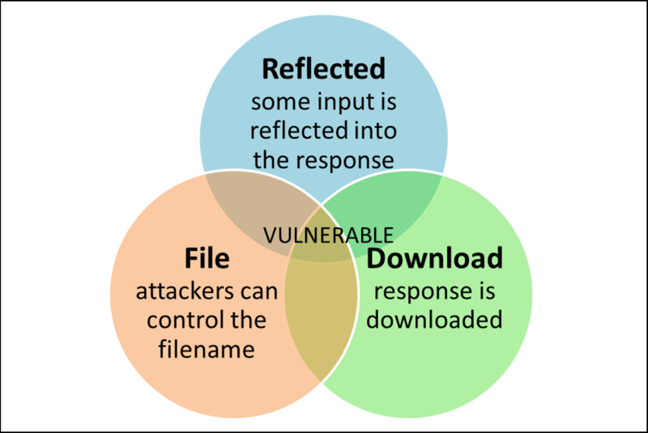

## CVE-2020-5421漏洞 spring相关代码探寻

CVE-2020-5421 是2020年9月底出现的一个spring的危险等级为high的一个漏洞，漏洞可以通过jessionsid路径参数，绕过防御RFD攻击的保护，攻击者利用漏洞使用户下载恶意文件，危及用户终端
	
> 详细介绍可见 <a>https://tanzu.vmware.com/security/cve-2020-5421</a> 

### 影响及修复版本

- spring影响版本
	- 5.2.0-5.2.8
	- 5.1.0-5.1.17
	- 5.0.0-5.0.18
	- 4.3.0-4.3.28
- spring修复版本
	- 5.2.9
	- 5.1.18
	- 5.0.19
	- 4.3.29	

### RFD 简单介绍

RFD（reflected file download）攻击有3个简单的要求

- reflected 反射 ，用户的输入通过url反射到response返回，用来注入shell命令
- file 访问的url允许文件格式结尾，并可以接收其他的输入，这种情况比较常见，
- download 下载对应的response，并创建步骤2中表示的文件



### 源码部分分析

CVE-2015-5211是针对Spring内容协商机制(content-negotiation)的滥用导致的RFD漏洞。

这个问题早在2015年就已修复，但是CVE-2020-5421 是针对 CVE-2015-5211修复方式的绕过,可以看到它对应的提交记录
<a>https://github.com/spring-projects/spring-framework/commit/2bd1da</a>

简单场景再现

> 使用版本为`5.2.0`

* 写一个简单demo

```java
@Controller
@RequestMapping(value = "/spring")
public class demoController {

	@RequestMapping("rfd")
	@ResponseBody
	public String index(String content){
		return content;
	}

}
```

* 正常发送请求

```
curl  -v  'http://localhost:8080/spring/rfd?content=avc'

*   Trying ::1...
* TCP_NODELAY set
* Connected to localhost (::1) port 8080 (#0)
> GET /spring/rfd?content=avc HTTP/1.1
> Host: localhost:8080
> User-Agent: curl/7.64.1
> Accept: */*
>
< HTTP/1.1 200
< Content-Type: text/plain;charset=UTF-8
< Content-Length: 3
< Date: Mon, 19 Oct 2020 08:12:19 GMT
<
* Connection #0 to host localhost left intact

```

* url结尾加.json

```
curl  -v 'http://localhost:8080/spring/rfd.json?content=avc'                                                                                                           16:20:18  ☁  master ☂ 𝝙 ✭ 𝝙
*   Trying ::1...
* TCP_NODELAY set
* Connected to localhost (::1) port 8080 (#0)
> GET /spring/rfd.json?content=avc HTTP/1.1
> Host: localhost:8080
> User-Agent: curl/7.64.1
> Accept: */*
>
< HTTP/1.1 404
< Vary: Origin
< Vary: Access-Control-Request-Method
< Vary: Access-Control-Request-Headers
< Content-Type: application/json
< Transfer-Encoding: chunked
< Date: Mon, 19 Oct 2020 08:22:41 GMT
<
* Connection #0 to host localhost left intact
{"timestamp":"2020-10-19T08:22:41.467+0000","status":404,"error":"Not Found","message":"No message available","path":"/spring/rfd.json"} 

```

content-type发生了对应变化 ，但是resp是显示访问失败了的，这个是已修复了,但是如果现在在url拼接`;JSESSIONID=`之后，就会绕过之前的修复，可见代码

```
	/**
	 * spring-webmvc/src/main/java/org/springframework/web/servlet/mvc/method/annotation/AbstractMessageConverterMethodProcessor.java
	 *  2015年修复的RFD漏洞， 是否具有文件扩展名，以及扩展名是否在白名单中，或已注册，没有的花，需要带有Content-Disposition 防止RFD攻击
	 * Check if the path has a file extension and whether the extension is either
	 * {@link #WHITELISTED_EXTENSIONS whitelisted} or
	 * {@link ContentNegotiationManager#getAllFileExtensions() explicitly
	 * registered}. If not add a 'Content-Disposition' header with a safe
	 * attachment file name ("f.txt") to prevent RFD exploits.
	 */
	private void addContentDispositionHeader(ServletServerHttpRequest request,
			ServletServerHttpResponse response) {

		HttpHeaders headers = response.getHeaders();
		if (headers.containsKey(HttpHeaders.CONTENT_DISPOSITION)) {
			return;
		}

		HttpServletRequest servletRequest = request.getServletRequest();
		String requestUri = RAW_URL_PATH_HELPER.getOriginatingRequestUri(servletRequest);

		int index = requestUri.lastIndexOf('/') + 1;
		String filename = requestUri.substring(index);
		String pathParams = "";

		index = filename.indexOf(';');
		if (index != -1) {
			pathParams = filename.substring(index);
			filename = filename.substring(0, index);
		}

		filename = DECODING_URL_PATH_HELPER.decodeRequestString(servletRequest, filename);
		String ext = StringUtils.getFilenameExtension(filename);

		pathParams = DECODING_URL_PATH_HELPER.decodeRequestString(servletRequest, pathParams);
		String extInPathParams = StringUtils.getFilenameExtension(pathParams);

		if (!isSafeExtension(ext) || !isSafeExtension(extInPathParams)) {
			headers.add(HttpHeaders.CONTENT_DISPOSITION, "attachment;filename=f.txt");
		}
	}

```

然后在`getOriginatingRequestUri(servletRequest)`中

```
       /**
	* 
	*/
	private String removeJsessionid(String requestUri) {
		int startIndex = requestUri.toLowerCase().indexOf(";jsessionid=");
		if (startIndex != -1) {
			int endIndex = requestUri.indexOf(';', startIndex + 12);
			String start = requestUri.substring(0, startIndex);
			requestUri = (endIndex != -1) ? start + requestUri.substring(endIndex) : start;
		}
		return requestUri;
	}

```

修复之后的`getOriginatingRequestUri(servletRequest)`代码如下
```
private String removeJsessionid(String requestUri) {
		String key = ";jsessionid=";
		int index = requestUri.toLowerCase().indexOf(key);
		if (index == -1) {
			return requestUri;
		
		}
		String start = requestUri.substring(0, index);
		for (int i = key.length(); i < requestUri.length(); i++) {
			char c = requestUri.charAt(i);
			if (c == ';' || c == '/') {
				return start + requestUri.substring(i);
			
			}
		
		}
		return start;	
}

```

此时关注spring另一个特性，URL路径中添加;开头字符串的path仍可正常访问请求，如
http://x.x.x.x/spring/rfd?content=111
http://x.x.x.x/spring/;xxx/rfd?content=111
是可以得到同样响应的,在修复之后再执行前面的url,会在content-type上添加
`Content-Disposition:inline;filename=f.txt`头


