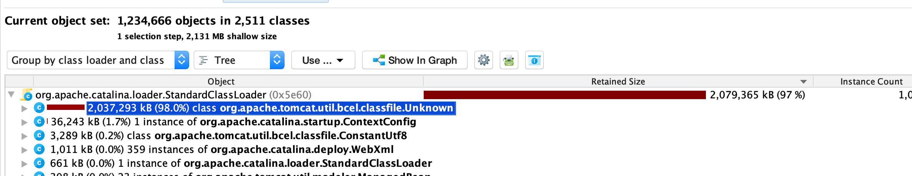
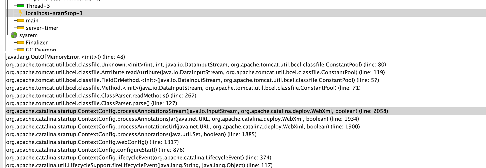
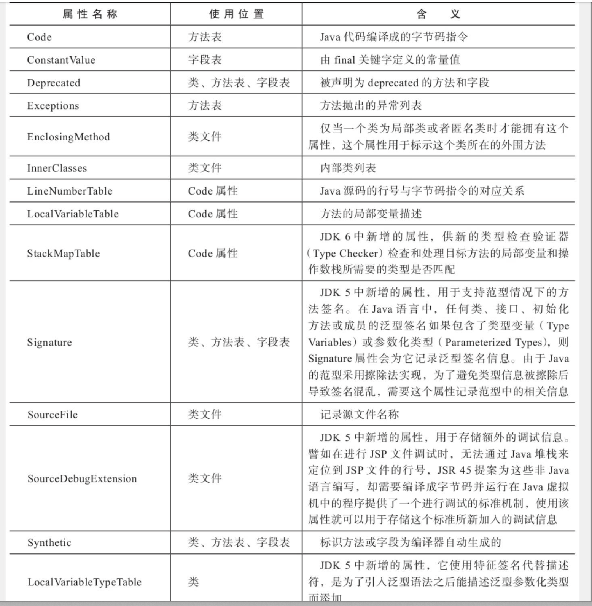
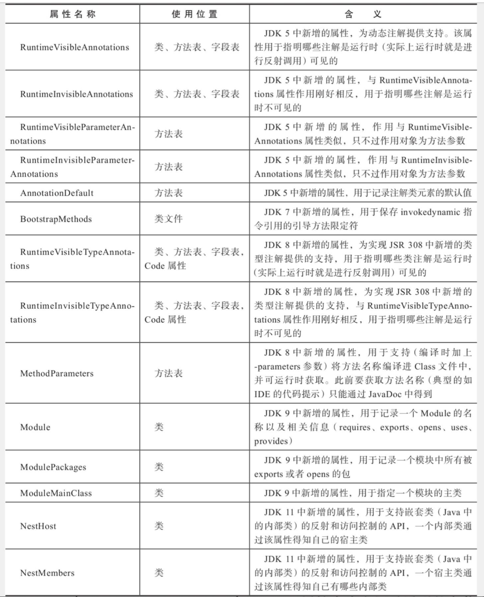

## Tomcat 加载包导致OOM

遇到一个问题,启动时加载facade包后,导致出现tomcat启动时出现大量OOM,创建了超过2G的UNKNOW的对象

### 环境介绍

当前使用的是java8+ tomcat 7.0.54

### 结果分析

首先获取下内存 dump,进行分析,这里我推荐使用JProfile工具可视化程度较高,方便快捷,加载完之后可以显然看到2个异常的地方

- 启动的时候创建了超过2G的**Unknow**对象



- tomcat localhost-startstop线程,启动的时候出现了OOM的异常

  


这里的OOM堆栈的上一个行为就是创建**Unknow**的对象,正好印证了OOM的罪魁祸首在这个代码中

### 过程分析

从第二点的调用堆栈可以明显看出,在调用 `org.apache.catalina.startup.ContextConfig#webConfig`的时候出现的OOM,而我们提供的Facade的包的主要功能就是提供dubbo接口,而我启动的项目的dubbo加载是通过配置`dubbo- reference` xml进行加载,整个流程如下

- 项目为tomcat项目,需要在`web.xml`写入需要加载的`spring-application.xml`,启动的时候才会去初始化对应的spring bean.
- 我们在初始化dubbo接口的时候,dubbo的接口是写在xml中, 所以也会由上面描述的`#webConfig`对我们写入的xml进行处理
- 当我们Facade的接口去初始化的时候,会通过tomcat的`classFile.parse()`,这个时候解析异常,最终出现大量**UNKNOW**实例 (这里为啥会出现大量对象的原因没有找到,按照加载逻辑是不会同时出现图中1百万个对象)

知道了产生这个**UNKNOW**的过程,现在最主要的问题是什么情况下产生这个问题,实践出真知,接下来分析下产生的条件,

首先我们需要准备一个tomcat-7.0.54包

> wget https://archive.apache.org/dist/tomcat/tomcat-7/v7.0.54/src/apache-tomcat-7.0.54-src.tar.gz

首先是`org.apache.catalina.startup.ContextConfig#processAnnotationsStream`这里就是加载jar包中的类并转成对应JavaClass

```java
protected void processAnnotationsStream(InputStream is, WebXml fragment,
            boolean handlesTypesOnly)
            throws ClassFormatException, IOException {
			
        ClassParser parser = new ClassParser(is, null);
  			
        JavaClass clazz = parser.parse();
        checkHandlesTypes(clazz);
 		    ...
}
```

后面的主要问题在**parse()** 中的

```java
public static final Attribute readAttribute(DataInputStream file,
            ConstantPool constant_pool) throws IOException,
            ClassFormatException
    {
        ConstantUtf8 c;
        String name;
        int name_index;
        int length;
        byte tag = Constants.ATTR_UNKNOWN; // Unknown attribute
        // Get class name from constant pool via `name_index' indirection
	      // 通过“name_index”间接从常量池中获取类名
        name_index = file.readUnsignedShort();
        // 找到映射关系
        c = (ConstantUtf8) constant_pool.getConstant(name_index,
                Constants.CONSTANT_Utf8);
        name = c.getBytes();
        // Length of data in bytes
        length = file.readInt();
        // Compare strings to find known attribute
        // System.out.println(name);
        for (byte i = 0; i < Constants.KNOWN_ATTRIBUTES; i++)
        {
            if (name.equals(Constants.ATTRIBUTE_NAMES[i]))
            {
                tag = i; // found!
                break;
            }
        }
        // Call proper constructor, depending on `tag'
        switch (tag)
        {
        case Constants.ATTR_UNKNOWN:
            AttributeReader r = readers.get(name);
            if (r != null)
            {
                return r.createAttribute(name_index, length, file,
                        constant_pool);
            }
            return new Unknown(name_index, length, file, constant_pool);
         ...
           //后面忽略
    }
```

可见其执行逻辑是:

- 读取class文件,获取当前属性
- 循环判断该属性是不是其tomcat写死的属性表中的类型
- 根据其属性创建不同的Attribute

这里涉及到属性表, 在class文件,字段表,方法表都可以携带自己的属性表集合,以描述某些场景特有信息,任何人实现的编译器都可以向属性表写入自己的属性.虚拟机在执行的时候会忽略不认识的属性.在最新的Java SE 12中,预定义属性已经增加到29项,下面是一些常用的属性






而在当前版本Tomcat中定义的属性表为:

```java
public static final String[] ATTRIBUTE_NAMES = {
  "SourceFile", "ConstantValue", "Code", "Exceptions",
  "LineNumberTable", "LocalVariableTable",
  "InnerClasses", "Synthetic", "Deprecated",
  "PMGClass", "Signature", "StackMap", 
  "RuntimeVisibleAnnotations", "RuntimeInvisibleAnnotations",
  "RuntimeVisibleParameterAnnotations", "RuntimeInvisibleParameterAnnotations",
  "AnnotationDefault", "LocalVariableTypeTable", "EnclosingMethod", "StackMapTable",
  "BootstrapMethods", "MethodParameters"
};
```

可见有些属性在tomcat中是没有定义到的,而当其没有找到定义的时候,就会去创建**UNKNOW**对象,到这里**UNKNOW**对象产生的流程已经出来了,不过要去验证下我们提供的jar包是否真的会产生该问题

#### 源jar包分析

由于我们提供的jar包实体是非常的简单的,只有接口与类,`pom.xml`中包含的jar包如下

```xml
<dependency>
    <groupId>javax.validation</groupId>
    <artifactId>validation-api</artifactId>
    <version>${version.validation-api}</version>
    <optional>true</optional>
</dependency>
<dependency>
    <groupId>com.fasterxml.jackson.core</groupId>
    <artifactId>jackson-annotations</artifactId>
    <version>${version.fasterxml.jackson}</version>
    <optional>true</optional>
</dependency>
```

只有Lombok,validation,jackson的相关注解,我们在一系列排除后怀疑到了2个主要注解上

- Lombok包提供的注解
- Validation提供的注解

然后我们找了一个类,对其class进行反汇编分析

```java

import lombok.Data;

import javax.validation.Valid;
import javax.validation.constraints.Max;
import javax.validation.constraints.NotNull;
import java.io.Serializable;

@Data
public class ReceiveLimitIdentityDTO implements Serializable {
    /**
     * 限制维度类型
     *
     */
    @NotNull(message = "限制维度类型不能为空.", groups = {ActActivityReq.GroupAdd.class, ActActivityReq.GroupModify.class})
    private Integer dimensionType;
    /**
     * 每日统计限制
     */
    @NotNull(message = "每日统计限制不能为空.", groups = {ActActivityReq.GroupAdd.class, ActActivityReq.GroupModify.class})
    @Valid
    private StatLimit dayStatLimit;
    /**
     * 累计统计限制
     */
    @NotNull(message = "累计统计限制不能为空.", groups = {ActActivityReq.GroupAdd.class, ActActivityReq.GroupModify.class})
    @Valid
    private StatLimit totalStatLimit;

    @Data
    public static class StatLimit implements Serializable {
        /**
         * 限制类型 type 0无限次 1限次      
         */
        @NotNull(message = "限制类型不能为空.", groups = {ActActivityReq.GroupAdd.class, ActActivityReq.GroupModify.class})
        private Integer type;
        /**
         * 限制次数 -1无限制
         */
        @Max(value = 999, message = "限制次数不能大于999.", groups = {ActActivityReq.GroupAdd.class, ActActivityReq.GroupModify.class})
        @NotNull(message = "限制次数不能为空.", groups = {ActActivityReq.GroupAdd.class, ActActivityReq.GroupModify.class})
        private Integer num;
    }
}
```

生成的反编译文件如下

```java
Classfile /Users/fulln/IdeaProjects/demo/target/classes/com/example/demo/tomcat/ReceiveLimitIdentityDTO.class
  Last modified 2021-12-13; size 3667 bytes
  MD5 checksum 9c50a675fb864b5ca41a2f596ad06ebb
  Compiled from "ReceiveLimitIdentityDTO.java"
public class com.example.demo.tomcat.ReceiveLimitIdentityDTO implements java.io.Serializable
  minor version: 0
  major version: 52
  flags: ACC_PUBLIC, ACC_SUPER
Constant pool:
    #1 = Methodref          #21.#91       // java/lang/Object."<init>":()V
    #2 = Fieldref           #5.#92        // com/example/demo/tomcat/ReceiveLimitIdentityDTO.dimensionType:Ljava/lang/Integer;
    #3 = Fieldref           #5.#93        // com/example/demo/tomcat/ReceiveLimitIdentityDTO.dayStatLimit:Lcom/example/demo/tomcat/ReceiveLimitIdentityDTO$StatLimit;
    #4 = Fieldref           #5.#94        // com/example/demo/tomcat/ReceiveLimitIdentityDTO.totalStatLimit:Lcom/example/demo/tomcat/ReceiveLimitIdentityDTO$StatLimit;
    #5 = Class              #95           // com/example/demo/tomcat/ReceiveLimitIdentityDTO
    #6 = Methodref          #5.#96        // com/example/demo/tomcat/ReceiveLimitIdentityDTO.canEqual:(Ljava/lang/Object;)Z
    #7 = Methodref          #5.#97        // com/example/demo/tomcat/ReceiveLimitIdentityDTO.getDimensionType:()Ljava/lang/Integer;
    #8 = Methodref          #21.#98       // java/lang/Object.equals:(Ljava/lang/Object;)Z
    #9 = Methodref          #5.#99        // com/example/demo/tomcat/ReceiveLimitIdentityDTO.getDayStatLimit:()Lcom/example/demo/tomcat/ReceiveLimitIdentityDTO$StatLimit;
   #10 = Methodref          #5.#100       // com/example/demo/tomcat/ReceiveLimitIdentityDTO.getTotalStatLimit:()Lcom/example/demo/tomcat/ReceiveLimitIdentityDTO$StatLimit;
   #11 = Methodref          #21.#101      // java/lang/Object.hashCode:()I
   #12 = Class              #102          // java/lang/StringBuilder
   #13 = Methodref          #12.#91       // java/lang/StringBuilder."<init>":()V
   #14 = String             #103          // ReceiveLimitIdentityDTO(dimensionType=
   #15 = Methodref          #12.#104      // java/lang/StringBuilder.append:(Ljava/lang/String;)Ljava/lang/StringBuilder;
   #16 = Methodref          #12.#105      // java/lang/StringBuilder.append:(Ljava/lang/Object;)Ljava/lang/StringBuilder;
   #17 = String             #106          // , dayStatLimit=
   #18 = String             #107          // , totalStatLimit=
   #19 = String             #108          // )
   #20 = Methodref          #12.#109      // java/lang/StringBuilder.toString:()Ljava/lang/String;
   #21 = Class              #110          // java/lang/Object
   #22 = Class              #111          // java/io/Serializable
   #23 = Class              #112          // com/example/demo/tomcat/ReceiveLimitIdentityDTO$StatLimit
   #24 = Utf8               StatLimit
   #25 = Utf8               InnerClasses
   #26 = Utf8               dimensionType
   #27 = Utf8               Ljava/lang/Integer;
   #28 = Utf8               RuntimeVisibleAnnotations
   #29 = Utf8               Ljavax/validation/constraints/NotNull;
   #30 = Utf8               message
   #31 = Utf8               限制维度类型不能为空.
   #32 = Utf8               groups
   #33 = Class              #114          // com/example/demo/tomcat/ActActivityReq$GroupAdd
   #34 = Utf8               GroupAdd
   #35 = Utf8               Lcom/example/demo/tomcat/ActActivityReq$GroupAdd;
   #36 = Class              #115          // com/example/demo/tomcat/ActActivityReq$GroupModify
   #37 = Utf8               GroupModify
   #38 = Utf8               Lcom/example/demo/tomcat/ActActivityReq$GroupModify;
   #39 = Utf8               RuntimeVisibleTypeAnnotations
     
     ...
     //后面省略

```


发现了# 39 常量.也就是对应validate包中的` @NotNull(message = "限制维度类型不能为空.", groups = {ActActivityReq.GroupAdd.class, ActActivityReq.GroupModify.class})`反汇编出来使用的属性是`RuntimeVisibleTypeAnnotations`,没有出现在Tomcat的属性表中,至此,产生的逻辑也出现了

#### 待解决

现在仍然需要解决的问题是 

1. 即使是在字段上面,但是创建总一百万个Objects,也是不太能实现的,内存也没有出现一直增长,只是启动时的飙升
2. 我们尝试把Lombok包中的`@Accessors(chain = true)`去掉之后没有产生了如此多的**UNKNOW**,但是毫无代码证据证明其关联性

欢迎讨论指教上面的2个疑问


