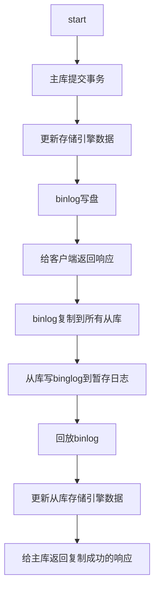

#lib #geektime #后端存储实战课 

# 12 | MySQL如何应对高并发（二）：读写分离

## 读写分离是提升 MySQL 并发的首选方案

> [!note] 数据库需要应对的绝大部分请求都是只读查询请求

主库负责执行应用程序发来的所有数据更新请求，然后异步将数据变更实时同步到所有的从库中去，这样，主库和所有从库中的数据是完全一样的。多个从库共同分担应用的查询请求。

### 同步方式

1. 纯手工方式：修改应用程序的 DAO 层代码，定义读写两个数据源，指定每一个数据库请求的数据源。
2. 组件方式：也可以使用像 Sharding-JDBC 这种集成在应用中的第三方组件来实现，这些组件集成在你的应用程序内，代理应用程序的所有数据库请求，自动把请求路由到对应数据库实例上。
3. 代理方式：在应用程序和数据库实例之间部署一组数据库代理实例，比如说 Atlas 或者 MaxScale。对应用程序来说，数据库代理把自己伪装成一个单节点的 MySQL 实例，应用程序的所有数据库请求被发送给代理，代理分离读写请求，然后转发给对应的数据库实例。

一般情况下，不推荐使用第三种代理的方式，原因是，使用代理加长了你的系统运行时数据库请求的调用链路，有一定的性能损失，并且代理服务本身也可能出现故障和性能瓶颈等问题。但是，代理方式有一个好处是，它对应用程序是完全透明的。所以，**只有在不方便修改应用程序代码这一种情况下，你才需要采用代理方式。**

### 注意读写分离带来的数据不一致问题

数据库中的数据在主库完成更新后，是异步同步到每个从库上的，这个过程有一个微小的时间差，这个时间差叫主从同步延迟

这种问题其实没什么好的技术手段来解决，所以你看大的电商，它支付完成后是不会自动跳回到订单页的，它增加了一个无关紧要的“支付完成”页面，其实这个页面没有任何有效的信息，就是告诉你支付成功，然后再放一些广告什么的。

> [!warning] 对于这种主从延迟带来的数据不一致的问题，没有什么简单方便而且通用的技术方案可以解决，我们需要重新设计业务逻辑，尽量规避更新数据后立即去从库查询刚刚更新的数据。

# 13 | MySQL主从数据库同步是如何实现的？

### 配置主从同步

MYSQL 集群从提交到响应一般经过

**提交事务和复制这两个流程在不同的线程中执行，互相不会等待，这是异步复制。**

#### 为什么主库存在丢数据的风险

因为异步复制它没有办法保证数据能第一时间复制到从库上。

1. 异步复制时，主库提交事务之后，就会给客户端返回响应；
2. 而同步复制时，主库在提交事务的时候，会等待数据复制到所有从库之后，再给客户端返回响应。

但是基本没法用同步复制

1. 一是性能很差，因为要复制到所有节点才返回响应；
2. 二是可用性也很差，主库和所有从库任何一个数据库出问题，都会影响业务。

#### 半同步复制

半同步复制介于二者之间，事务线程不用等着所有的复制成功响应，只要一部分复制响应回来之后，就可以给客户端返回了。

一主二从的集群，配置成半同步复制，只要数据成功复制到任意一个从库上，主库的事务线程就直接返回了

#### 半同步复制参数

配置半同步复制的时候，有一个重要的参数`rpl_semi_sync_master_wait_slave_count` 至少等待数据复制到几个从节点再返回

另外一个重要的参数是`rpl_semi_sync_master_wait_point`，这个参数控制主库执行事务的线程，是在提交事务之前（AFTER_SYNC）等待复制，还是在提交事务之后（AFTER_COMMIT）等待复制
默认是 AFTER_SYNC.这样完全不会丢数据

#### 风险点

主库提交事务等待的时间超时了，仍会被正常提交。并且自动降级为异步复制模式。直到有足够多的从库追上主库。如果这个时候主库宕机，仍然存在丢数据的风险

### 复制状态机

在 MySQL 中，无论是复制还是备份恢复，依赖的都是全量备份和 Binlog，全量备份相当于备份那一时刻的一个数据快照，Binlog 则记录了每次数据更新的变化，也就是操作日志

**虽然讲的都是 MySQL，但是你要知道，这种基于`快照 + 操作日志`的方法，不是 MySQL 特有的。**

几乎所有的存储系统和数据库，都是用这一套方法来解决备份恢复和数据复制问题的。

这一套方法其实是有理论基础的，叫做复制状态机 ([Replication State Machine](https://en.wikipedia.org/wiki/State_machine_replication))，我能查到的最早的出处是 1978 年 Lamport 的一篇论文《[The Implementation of Reliable Distributed Multiprocess Systems](http://lamport.azurewebsites.net/pubs/implementation.pdf)》。

# 地址

此文章为3月day28 学习笔记，内容来源于[极客时间](https://time.geekbang.org/column/article/215330)，
