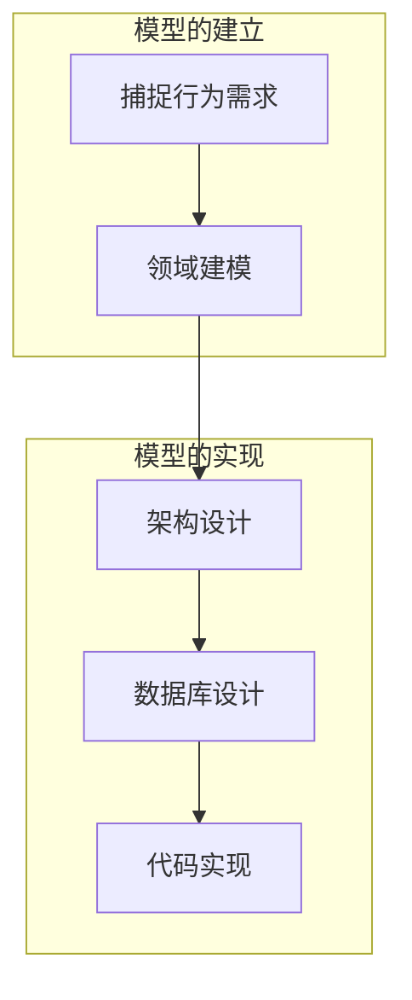

#DDD #设计思想 

## 基本开发流程

### 捕捉行为需求

**统一语言**，业务人员和开发人员使用的语言要一致

#### 用例建模（ 事件风暴）

事件风暴主要应用在需求不清晰，或者理解不统一的情况下，通过协作的方式理清业务、达成一致，所以通常对于新项目比较适用。

- 识别领域事件
	- **领域事件**就是业务流程中每一步引发的结果
	- 不要把技术事件当成领域事件
	- 查询功能不算领域事件
- 识别命令
	- 除了识别出命令本身以外，我们通常还要识别出谁执行的命令，以及为了执行命令我们要查询出什么数据。
- 识别领域名词
	- 从命令、领域事件、执行者、查询数据里找到的名词性概念
	- 聚合后找到对应领域名词

### 领域建模

建立领域模型，主要是要识别**领域对象（domain object）**，**领域对象之间的关系**，以及**领域对象的关键属性**，必要的时候还要将**领域对象组织成模块**。

#### 领域对象

DDD 中将领域对象又分成**实体（entity）** 和**值对象（value object）**

##### 实体

1. 实体间的关系
- 一对一
- 一对多
- 多对多
	- 任何多对多关联，总能用类似的方法，通过引入一个表示关联的实体，拆成两个一对多的关联。

2. 对实体进行抽象
- 归纳共性
- 自关联
- 约束

3. 构建模块
>1. 宏观层面
>	- 关心模型中有哪些模块,以及模块间的依赖关系
>	- 模块的关联表示的是数据上的导航关系
> 2. 微观层面
> 	- 完善业务规则
> 	- 建立词汇表

#### 领域模型

1. 特点
>模型是以解决特定问题为目的的
>模型都是对现实世界或人们思维中的事物进行的模拟
>模型总是提取了被模拟事物中的部分信息，而忽略掉了其他大部分信息
>模型可以有多种表现形式

2. DDD 领域模型与传统方法的不同之处
> DDD 强调领域模型要兼顾业务和技术两个视角。

3. **模型驱动设计**
*DDD的核心模式*
>领域模型要和业务需求一致；
>	通过抽象获得更深刻的模型
>	通过思考获得更丰富的模型
>系统实现要和领域模型一致。
>	领域模型中的每个元素，都应该通过某种方式在系统实现中有所体现

### 架构设计
微服务设计、中台设计都属于进程间架构。而 DDD 分层架构，通常说的是进程内架构。

#### 分层设计
能够理解分层架构背后的原理，然后针对自己项目中存在的痛点进行权衡，形成适合自己项目的架构规范。

##### 分离领域
领域层封装了领域数据和逻辑，我们前面的领域模型所对应的代码，主要就体现在领域层。只有将领域层独立出来，才能保证与领域模型的一致，也才能让领域层独立演化

1. domain
>  实体类, 值对象
2. app
应用逻辑层,只是对领域逻辑的编排
>  1. 接受请求,调用和协调domain层
>  2. 将domain层的结果封装成更细粒度的对象(负责domain 和DTO 的转换)
>  3. 处理事务,日志,权限等切面,
3. adapter
处理输入输出技术,对接不同标准
> 对外:restful,rpc,message,job
> 对内: Persistence
4. infrastructure
基础设施
> util, common

#### 代码实现

原则: **在领域对象不直接或间接访问数据库的前提下，尽量面向对象**

1. 贫血模型: 领域对象中只有数据，没有行为
2. 充血模型: 领域对象里既包含数据，也包含行为

##### 创建领域对象
1. 表意接口
	每个类和方法的命名都应该尽量直观地反映领域知识，与统一语言保持一致,违反了表意接口模式，常常会出现过长的函数和注释这两个坏味道，我们可以通过抽取函数这个重构手法进行了解决。
2. 领域服务（Domain Service）模式
	把业务规则移动到领域层，本质原因是业务规则属于“领域逻辑”，表达了领域知识。相应地，一般把应用层的逻辑称为“应用逻辑”。

##### 工厂模式
创建聚合
1. 用 Builder 模式将对应聚合放到了domain层,并在此创建出领域对象
2. DTO对象的划分

##### 模块划分

一个应用服务和调用它的控制器以及被它调用的领域对象之间才具有耦合性

1. 第一种方法是按照类的“性质”来分的
2. 第二种是按照耦合关系来分

### 数据库设计
数据库设计与领域模型保持一致。

### 代码实现

![[lib/geektime/落地DDD/《手把手教你落地 DDD》学习笔记Day1#领域对象的封装和继承]]

![[lib/geektime/落地DDD/《手把手教你落地 DDD》学习笔记Day1#编程风格]]

